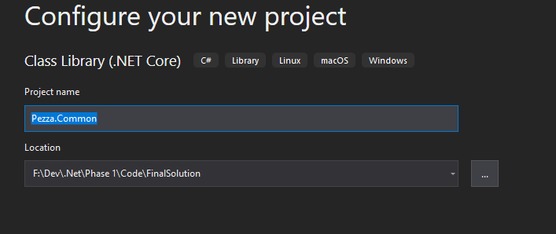

# &nbsp;**Pezza - Phase 1**

<br/><br/>

We will be looking at creating a solution for Pezza's customers only. We will start off with how a typical solution might look like and refactoring it into a clean architecture that can be used through out the rest of the incubator. We will only be focussing on the Pezza Stock for the Phase. This is to show the importance of Single Responsibility and how basic CQRS works.

## **Setup**

- [ ] Setup a new Pezza Solution
  - [ ] Open Visual Studio - Create a new project

  - [ ] ASP.NET Core Web Application

- [ ] Run SQL file on your local SQL Server

### **Single Responsibility Principle**

- [ ] We don't want everything in one folder and we want to follow the Single Responsibility Principle.
  - [ ] Right Click on the Solution - Add New Solution Folder. Call it *01 Apis*. This is where we want to group all Apis together. Move the Api you create into the *01 Apis* <br/>
  - [ ] Next we want to create a Common project that can be used between all Projects
    - [ ] Create a new Solution Folder *02 Common*
    - [ ] Create a new Class Library Pezza.Common <br/>  <br/> 
    - [ ] Createa folder *Entities* where all database models will go into <br/> 
    - [ ] Create a Entity Stock.cs in a folder Entities <br/>
``` 
namespace Pezza.Api.Entities
{
    using System;

    public class Stock
    {
        public int Id { get; set; }

        public string Name { get; set; }

        public string UnitOfMeasure { get; set; }

        public double? ValueOfMeasure { get; set; }

        public int Quantity { get; set; }

        public DateTime? ExpiryDate { get; set; }

        public DateTime DateCreated { get; set; }

        public string Comment { get; set; }
    }
}
```

### **Connecting to the Database**

- [ ] Next create a new Solution Folder *03 Database*
- [ ] Create a new Class Library Pezza.DataAccess and Pezza.DataAccess.Contracts (This will used for Dependency Injection and Unit Tests) <br/> 
- [ ] For interacting with the Database we will be using Entity Framework Core. Right click on the Pezza.DataAccess and Pezza.DataAccessContracts project *Manage NuGet Packages...*. Search for EFCore Nuget Package, Install the following Packages
  - [ ] Microsoft.EntityFrameworkCore
- [ ] Create a intreface in DataAccess.Contracts called IDatabaseContext.cs <br/> 

```
namespace Pezza.DataAccess.Contracts
{
    using Microsoft.EntityFrameworkCore;
    using Pezza.Common.Entities;

    public interface IDatabaseContext
    {
        DbSet<Stock> Stocks { get; set; }
    }
}
```
DbSet will act as a Repository to the Database
- [ ] To be able to map the Database Table to the Entity we use Mappings from EntityFrameworkCore. We also prefer using Mappings for Single Responsibility instead of using Attributes inside of an Entity. This allows the code to stay clean. Create a new folder inside Pezza.DataAccess *Mapping* with a class StockMap.cs <br/> 

```
namespace Pezza.DataAccess.Mapping
{
    using Microsoft.EntityFrameworkCore;
    using Pezza.Common.Entities;

    public partial class StockMap
        : IEntityTypeConfiguration<Stock>
    {
        public void Configure(Microsoft.EntityFrameworkCore.Metadata.Builders.EntityTypeBuilder<Stock> builder)
        {
            // table
            builder.ToTable("Stock", "dbo");

            // key
            builder.HasKey(t => t.Id);

            // properties
            builder.Property(t => t.Id)
                .IsRequired()
                .HasColumnName("Id")
                .HasColumnType("int")
                .ValueGeneratedOnAdd();

            builder.Property(t => t.Name)
                .IsRequired()
                .HasColumnName("Name")
                .HasColumnType("varchar(100)")
                .HasMaxLength(100);

            builder.Property(t => t.UnitOfMeasure)
                .HasColumnName("UnitOfMeasure")
                .HasColumnType("varchar(20)")
                .HasMaxLength(20);

            builder.Property(t => t.ValueOfMeasure)
                .HasColumnName("ValueOfMeasure")
                .HasColumnType("decimal(18, 2)");

            builder.Property(t => t.Quantity)
                .IsRequired()
                .HasColumnName("Quantity")
                .HasColumnType("int");

            builder.Property(t => t.ExpiryDate)
                .HasColumnName("ExpiryDate")
                .HasColumnType("datetime");

            builder.Property(t => t.DateCreated)
                .IsRequired()
                .HasColumnName("DateCreated")
                .HasColumnType("datetime")
                .HasDefaultValueSql("(getdate())");

            builder.Property(t => t.Comment)
                .HasColumnName("Comment")
                .HasColumnType("varchar(1000)")
                .HasMaxLength(1000);
        }

    }
}
```
This will map the table name and all the fields as well as indicate what the primary key will be.
- [ ] Now we need to create a DbContext.cs inside of Pezza.DataAccess that handles the ession with the database or can be seen as a unit of work. <br/> 
## **Create database entities and update database context**

```
namespace Pezza.DataAccess
{
    using Pezza.DataAccess.Contracts;
    using Microsoft.EntityFrameworkCore;
    using Pezza.Common.Entities;
    using Pezza.DataAccess.Mapping;

    public class DatabaseContext : DbContext, IDatabaseContext
    {
        public DatabaseContext()
        {
        }

        public DatabaseContext(DbContextOptions<DbContext> options)
            : base(options)
        {
        }

        public virtual DbSet<Stock> Stocks { get; set; }

        protected override void OnModelCreating(ModelBuilder modelBuilder)
        {
            modelBuilder.ApplyConfiguration(new StockMap());
        }
    }
}

```

## **Create Data Access class that will interact with DbContext**

To keep the calls to the database as clean as possible and single responsibility we will be creating Data Access classes for each entity.

- [ ] Create a intreface in DataAccess.Contracts called IStockDataAccess.cs <br/> 

```
namespace Pezza.DataAccess.Contracts
{
    using System.Collections.Generic;
    using System.Threading.Tasks;
    using Pezza.Common.Entities;

    public interface IStockDataAccess
    {
        Task<Stock> GetAsync(int id);

        Task<List<Stock>> GetAllAsync();

        Task<Stock> UpdateAsync(Stock entity);

        Task<Stock> SaveAsync(Stock entity);

        Task<bool> DeleteAsync(Stock entity);
    }
}
```