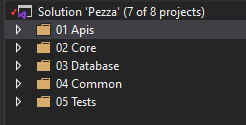
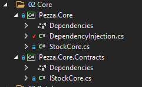
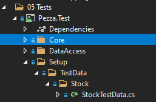
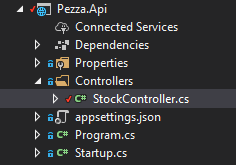
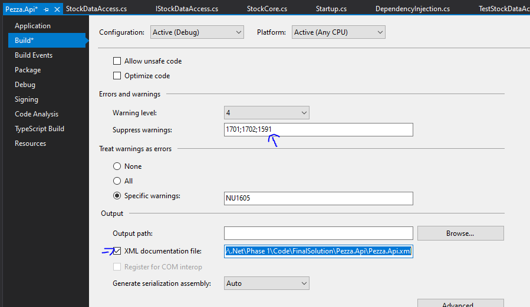
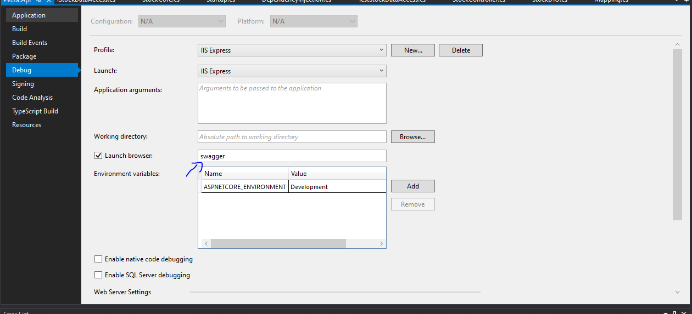
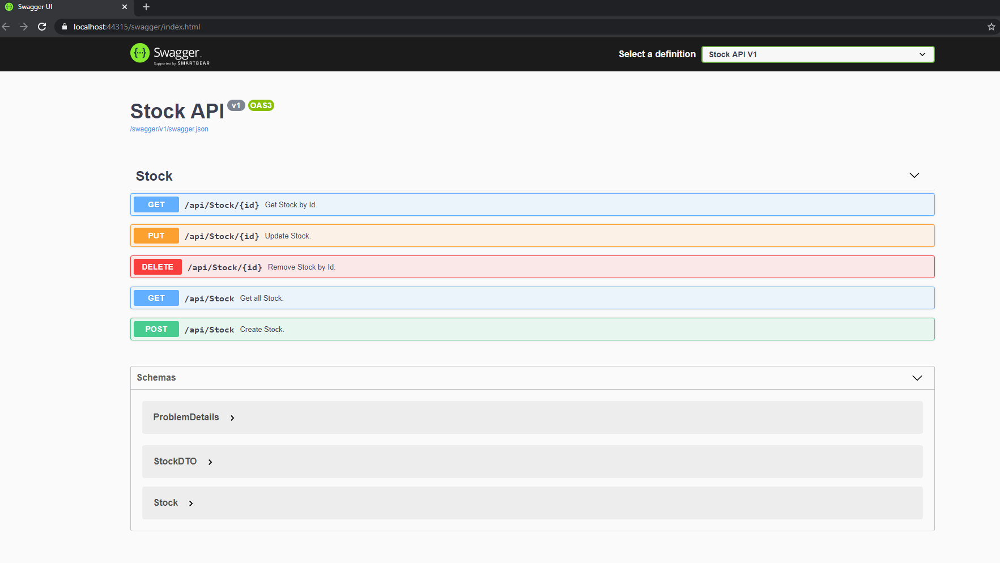

# &nbsp;**Pezza - Phase 1** [](https://github.com/entelect-incubator/.NET/actions/workflows/dotnet-phase1-finalsolution.yml)

<br/><br/>

We will be looking at creating a solution for Pezza's customers only. We will start with how a typical solution might look like and refactoring it into a clean architecture that can be used throughout the rest of the incubator. We will only be focussing on the Pezza Stock for the Phase. This is to show scaffold a new Solution and Projects for a Clean Architecture.

## **Setup**

- [ ] Setup a new Pezza Solution
  - [ ] Open Visual Studio - Create a new project


  - [ ] ASP.NET Core Web Application

- [ ] Run [SQL file](pezza-db.sql) on your local SQL Server
- [ ] We don't want everything in one folder and we want to follow the **Single Responsibility Principle**.
  - [ ] Right Click on the Solution - Add New Solution Folder. Call it *01 Apis*. This is where we want to group all Apis together. Move the Api you create into the *01 Apis* <br/>
  - [ ] Next we want to create a Common project that can be used between all Projects
    - [ ] Create a new Solution Folder *04 Common*
    - [ ] Create a new Class Library Pezza.Common <br/>  <br/> 
    - [ ] Create a folder *Entities* where all database models will go into <br/> 
    - [ ] Create a Entity Stock.cs in a folder Entities <br/>
    - [ ] 
``` 
namespace Pezza.Common.Entities
{
    using System;

    public class Stock
    {
        public int Id { get; set; }

        public string Name { get; set; }

        public string UnitOfMeasure { get; set; }

        public double? ValueOfMeasure { get; set; }

        public int Quantity { get; set; }

        public DateTime? ExpiryDate { get; set; }

        public DateTime DateCreated { get; set; }

        public string Comment { get; set; }
    }
}
```

## **Database Layer**

- [ ] Next create a new Solution Folder *03 Database*
- [ ] Create a new Class Library Pezza.DataAccess and Pezza.DataAccess.Contracts (This will used for Dependency Injection and Unit Tests) <br/> 
- [ ] Add Nuget Package to each project
  - [ ]  Microsoft.EntityFrameworkCore.Relational
  - [ ]  Sytem.Linq.Dynamic.Core in DataAccess
- [ ] For interacting with the Database we will be using Entity Framework Core. Right-click on the Pezza.DataAccess and Pezza.DataAccessContracts project *Manage NuGet Packages...*. Search for EFCore Nuget Package, Install the following Packages
  - [ ] Microsoft.EntityFrameworkCore
- [ ] Create an interface in DataAccess.Contracts called IDatabaseContext.cs <br/> 

```
namespace Pezza.DataAccess.Contracts
{
    using System.Threading;
    using System.Threading.Tasks;
    using Microsoft.EntityFrameworkCore;
    using Pezza.Common.Entities;

    public interface IDatabaseContext
    {
        DbSet<Stock> Stocks { get; set; }

        Task<int> SaveChangesAsync(CancellationToken cancellationToken = default);
    }
}
```
DbSet will act as a Repository to the Database. You will see we have added SaveChangesAsync into the interface, this is to expose DbContext Entity Framework Core methods in your interface.

- [ ] To be able to map the Database Table to the Entity we use Mappings from EntityFrameworkCore. We also prefer using Mappings for Single Responsibility instead of using Attributes inside of an Entity. This allows the code to stay clean. Create a new folder inside Pezza.DataAccess *Mapping* with a class StockMap.cs <br/> 

```
namespace Pezza.DataAccess.Mapping
{
    using Microsoft.EntityFrameworkCore;
    using Pezza.Common.Entities;

    public partial class StockMap
        : IEntityTypeConfiguration<Stock>
    {
        public void Configure(Microsoft.EntityFrameworkCore.Metadata.Builders.EntityTypeBuilder<Stock> builder)
        {
            // table
            builder.ToTable("Stock", "dbo");

            // key
            builder.HasKey(t => t.Id);

            // properties
            builder.Property(t => t.Id)
                .IsRequired()
                .HasColumnName("Id")
                .HasColumnType("int")
                .ValueGeneratedOnAdd();

            builder.Property(t => t.Name)
                .IsRequired()
                .HasColumnName("Name")
                .HasColumnType("varchar(100)")
                .HasMaxLength(100);

            builder.Property(t => t.UnitOfMeasure)
                .HasColumnName("UnitOfMeasure")
                .HasColumnType("varchar(20)")
                .HasMaxLength(20);

            builder.Property(t => t.ValueOfMeasure)
                .HasColumnName("ValueOfMeasure")
                .HasColumnType("decimal(18, 2)");

            builder.Property(t => t.Quantity)
                .IsRequired()
                .HasColumnName("Quantity")
                .HasColumnType("int");

            builder.Property(t => t.ExpiryDate)
                .HasColumnName("ExpiryDate")
                .HasColumnType("datetime");

            builder.Property(t => t.DateCreated)
                .IsRequired()
                .HasColumnName("DateCreated")
                .HasColumnType("datetime")
                .HasDefaultValueSql("(getdate())");

            builder.Property(t => t.Comment)
                .HasColumnName("Comment")
                .HasColumnType("varchar(1000)")
                .HasMaxLength(1000);
        }

    }
}
```
This will map the table name and all the fields as well as indicate what the primary key will be.

- [ ] Now we need to create a DbContext.cs inside of Pezza.DataAccess that handles the session with the database or can be seen as a unit of work. <br/> 


```
namespace Pezza.DataAccess
{
    using Microsoft.EntityFrameworkCore;
    using Pezza.Common.Entities;
    using Pezza.DataAccess.Mapping;

    public class DatabaseContext : DbContext
    {
        public DatabaseContext()
        {
        }

        public DatabaseContext(DbContextOptions options) : base(options)
        {
        }

        public virtual DbSet<Stock> Stocks { get; set; }

        protected override void OnModelCreating(ModelBuilder modelBuilder)
        {
            modelBuilder.ApplyConfiguration(new StockMap());
        }
    }
}

```

## **Data Access**

To keep the calls to the database as clean as possible and single responsibility we will be creating Data Access interfaces and classes for each entity.

- [ ] Create an interface in DataAccess.Contracts called IStockDataAccess.cs <br/> 

```
namespace Pezza.DataAccess.Contracts
{
    using System.Collections.Generic;
    using System.Threading.Tasks;
    using Pezza.Common.Entities;

    public interface IStockDataAccess
    {
        Task<Stock> GetAsync(int id);

        Task<List<Stock>> GetAllAsync();

        Task<Stock> UpdateAsync(Stock entity);

        Task<Stock> SaveAsync(Stock entity);

        Task<bool> DeleteAsync(int id);
    }
}
```

Create a new folder in *Pezza.DataAccess* called Data, add a new Data Access called StockDataAccess.cs. <br/> 

```
namespace Pezza.DataAccess.Data
{
    using System.Collections.Generic;
    using System.Linq;
    using System.Linq.Dynamic.Core;
    using System.Threading.Tasks;
    using Microsoft.EntityFrameworkCore;
    using Pezza.DataAccess.Contracts;

    public class StockDataAccess : IStockDataAccess
    {
        private readonly DatabaseContext databaseContext;

        public StockDataAccess(DatabaseContext databaseContext) 
            => this.databaseContext = databaseContext;

        public async Task<Common.Entities.Stock> GetAsync(int id)
        {
            return await this.databaseContext.Stocks.FirstOrDefaultAsync(x => x.Id == id);
        }

        public async Task<List<Common.Entities.Stock>> GetAllAsync()
        {
            var entities = await this.databaseContext.Stocks.Select(x => x).AsNoTracking().ToListAsync();

            return entities;
        }

        public async Task<Common.Entities.Stock> SaveAsync(Common.Entities.Stock entity)
        {
            this.databaseContext.Stocks.Add(entity);
            await this.databaseContext.SaveChangesAsync();

            return entity;
        }

        public async Task<Common.Entities.Stock> UpdateAsync(Common.Entities.Stock entity)
        {
            this.databaseContext.Stocks.Update(entity);
            await this.databaseContext.SaveChangesAsync();

            return entity;
        }

        public async Task<bool> DeleteAsync(int id)
        {
            var entity = await this.GetAsync(id);
            this.databaseContext.Stocks.Remove(entity);
            var result = await this.databaseContext.SaveChangesAsync();

            return (result == 1);
        }
    }
}
```
The interesting part here is, when you call SaveChangesAsync it will return the number of changed records in the database. If you save a new record it will return the result of 1.

## **Data Access Unit Test**

As we add value with the different layers, we need to make sure it is testable and create unit tests. This helps later on if code changes that Unit Tests will pick up any bugs.

There are a variety of ways we can setup Unit Tests, this is one way to do it.

- [ ] Next create a new Solution Folder *05 Tests*
- [ ] Create a new NUnit Test Project <br/> 
- [ ] Install Nuget Package
  - [ ]  Microsoft.EntityFrameworkCore.InMemory
  - [ ]  AutoMapper
- [ ] Create a **Setup folder**, create QueryTestBase.cs class this will be inherited by by different Entity Data Access Test classes to expose Create() function.


```
namespace Pezza.Test.Setup
{
    using System;
    using Pezza.DataAccess;
    using static DatabaseContextFactory;

    public class QueryTestBase : IDisposable
    {
        public DatabaseContext Context => Create();

        public void Dispose() => Destroy(this.Context);
    }
}
```

- [ ] Create DatabaseContextFactory.cs class in **Setup folder** that will be used to create a new DbContext object, but it will create a database session in memory.

```
namespace Pezza.Test.Setup
{
    using System;
    using Microsoft.EntityFrameworkCore;
    using Pezza.DataAccess;

    public class DatabaseContextFactory
    {
        protected DatabaseContextFactory()
        {
        }

        public static DatabaseContext DBContext()
        {
            var options = new DbContextOptionsBuilder<DbContext>().UseInMemoryDatabase(Guid.NewGuid().ToString()).Options;
            return new DatabaseContext(options);
        }

        public static DatabaseContext Create()
        {
            var context = DBContext();

            context.Database.EnsureCreated();

            return context;
        }

        public static void Destroy(DatabaseContext context)
        {
            context.Database.EnsureDeleted();

            context.Dispose();
        }
    }
}
```

- [ ] Install Bogus NuGet Package to your *Pezza.Test* Project.
- [ ] For clean code we will create Test Data for each Entity. Create a folder TestData, then create a folder Stock. Create a StockTestData.cs class. This will create a fake Stock Entity for testing. <br/> 

```
namespace Pezza.Test
{
    using System;
    using Bogus;
    using Pezza.Common.Entities;

    public static class StockTestData
    {
        public static Faker faker = new Faker();

        public static Stock Stock = new Stock()
        {
            Comment = faker.Lorem.Sentence(),
            DateCreated = DateTime.Now,
            ExpiryDate = DateTime.Now.AddMonths(1),
            Name = faker.Commerce.Product(),
            Quantity = 1,
            UnitOfMeasure = "kg",
            ValueOfMeasure = 10.5
        };
    }

}
```
- [ ] Create a new folder DataAccess, that will be used to test Stock Data Access. Create TestStockDataAccess.cs class. <br/> 

```
namespace Pezza.Test
{
    using System.Linq;
    using System.Threading.Tasks;
    using Bogus;
    using NUnit.Framework;
    using Pezza.DataAccess.Data;
    using Pezza.Test.Setup;
    using Pezza.Test.Setup.TestData.Stock;

    public class TestStockDataAccess : QueryTestBase
    {
        [Test]
        public async Task GetAsync()
        {
            var handler = new StockDataAccess(this.Context);
            var stock = StockTestData.Stock;
            await handler.SaveAsync(stock);

            var response = await handler.GetAsync(stock.Id);

            Assert.IsTrue(response != null);
        }

        [Test]
        public async Task GetAllAsync()
        {
            var handler = new StockDataAccess(this.Context);
            var stock = StockTestData.Stock;
            await handler.SaveAsync(stock);

            var response = await handler.GetAllAsync();
            var outcome = response.Any();

            Assert.IsTrue(outcome);
        }

        [Test]
        public async Task SaveAsync()
        {
            var handler = new StockDataAccess(this.Context);
            var stock = StockTestData.Stock;
            var result = await handler.SaveAsync(stock);
            var outcome = result.Id != 0;

            Assert.IsTrue(outcome);
        }

        [Test]
        public async Task UpdateAsync()
        {
            var handler = new StockDataAccess(this.Context);
            var stock = StockTestData.Stock;
            var originalStock = stock;
            await handler.SaveAsync(stock);

            stock.Name = new Faker().Commerce.Product();
            var response = await handler.UpdateAsync(stock);
            var outcome = response.Name.Equals(originalStock.Name);

            Assert.IsTrue(outcome);
        }

        [Test]
        public async Task DeleteAsync()
        {
            var handler = new StockDataAccess(this.Context);
            var stock = StockTestData.Stock;
            await handler.SaveAsync(stock);

            var response = await handler.DeleteAsync(stock.Id);

            Assert.IsTrue(response);
        }
    }
}
```

Lets break this down.

For every test we will create a new stock data access that will create a test session in memory to the database. We will then mock new stock using the stock test data. THen we will persist the new stock to the in-memory database.

- GetAsync (Tests the get stock by id) - We retrieve the newly created stock from the in-memory database using the stock id. If the data that gets return is found, your unit test is successful.
- GetAllAsync (Tests list of stock) - We retrieve a list of all the stock from the in-memory database. If the count of data returned is equalled to 1, your unit test is successful.
- SaveAsync (Tests creating new stock) - We verify the result of records changed from the save changes should equal to 1, meaning your unit test is successful.
- UpdateAsync (Tests updating existing stock) - We generate a new name for the stock item to be updated. We verify the updated stock's name with the updated stock if they are the same; your unit test is successful.
- DeleteAsync (Tests removing stock) - We verify the result of deleting the stock from the in-memory database. Depending on the result being returned will determine the outcome of the unit test.

## **Core Layer**

- [ ] Create a new Solution Folder *02 Core*, this where all of your business logic will be found. Imagine the "core" of the business lives here.
- [ ] Let us put all the Solution Folders in the correct order of use. Think of it as a vertical slice down to the database. Start with the API call, through to the Business Layer, through to the Data Access layer.
  - [ ] 01 Apis
  - [ ] 02 Core
  - [ ] 03 Database
  - [ ] 04 Common
  - [ ] 05 Tests <br/> 
- [ ] We don't always want to expose the entities properties back to API, we want to send back DTO (Data Transfer Objects).
  - Remove circular references.
  - Hide the particular properties that clients are not supposed to view.
  - Omit some properties to reduce the payload size.
  - Flatten object graphs that contain nested objects, to make them more convenient for clients.
  - Avoid "over-posting" vulnerabilities.
  - Decouple your service layer from your database layer
  - [Read More](https://docs.microsoft.com/en-us/aspnet/web-api/overview/data/using-web-api-with-entity-framework/part-5)
- [ ] Create a DTO folder in *Pezza.Common*
- [ ] Create a new Class StockDTO.cs <br/> 

```
namespace Pezza.Common.DTO
{
    using System;

    public class StockDTO
    {
        public int Id { get; set; }

        public string Name { get; set; }

        public string UnitOfMeasure { get; set; }

        public double? ValueOfMeasure { get; set; }

        public int? Quantity { get; set; }

        public DateTime? ExpiryDate { get; set; }

        public string Comment { get; set; }
    }
}
```
- [ ] We want to create Mapping between these 2 objects. Create a Mapping folder in *Pezza.Common*
  - [ ] Install Nuget Package AutoMapper
  - [ ] Create a new folder Profiles
  - [ ] Create a new class MappingProfile.cs

```cs
namespace Pezza.Common.Profiles
{
    using AutoMapper;
    using Pezza.Common.DTO;
    using Pezza.Common.Entities;

    public class MappingProfile : Profile
    {
        public MappingProfile()
        {
            this.CreateMap<Stock, StockDTO>();
            this.CreateMap<StockDTO, Stock>();
        }
    }
}

```

- [ ] In Pezza.Test QueryTestBase.cs add

```cs
public static IMapper Mapper()
{
    var mappingConfig = new MapperConfiguration(mc => mc.AddProfile(new MappingProfile()));
    return mappingConfig.CreateMapper();
}
```

- [ ] Create 2 new Class Libraries inside of *02 Core* - Pezza.Core and Pezza.Core.Contracts. We will start by using very basic Stock Core.
  - [ ] Installl Nuget Package Automapper on these 2 Projects.
  - [ ] Create a new IStockCore Interface in *Pezza.Core.Contracts* <br/> 

```cs
namespace Pezza.Core.Contracts
{
    using System.Collections.Generic;
    using System.Threading.Tasks;
    using Pezza.Common.DTO;
    using Pezza.Common.Entities;

    public interface IStockCore
    {
        Task<StockDTO> GetAsync(int id);

        Task<IEnumerable<StockDTO>> GetAllAsync();

        Task<StockDTO> UpdateAsync(StockDTO model);

        Task<StockDTO> SaveAsync(Stock model);

        Task<bool> DeleteAsync(int id);
    }
}
```

- [ ] Create a new StockCore.cs inside of *Pezza.Core* <br/> 

```cs
namespace Pezza.Core
{
    using System.Collections.Generic;
    using System.Threading.Tasks;
    using AutoMapper;
    using Pezza.Common.DTO;
    using Pezza.Common.Entities;
    using Pezza.Core.Contracts;
    using Pezza.DataAccess.Contracts;

    public class StockCore : IStockCore
    {
        private readonly IStockDataAccess dataAcess;

        private readonly IMapper mapper;

        public StockCore(IStockDataAccess dataAcess) => this.dataAcess = dataAcess;

        public async Task<StockDTO> GetAsync(int id)
        {
            var search = await this.dataAcess.GetAsync(id);

            return this.mapper.Map<StockDTO>(search);
        }

        public async Task<IEnumerable<StockDTO>> GetAllAsync()
        {
            var search = await this.dataAcess.GetAllAsync();

            return this.mapper.Map<List<StockDTO>>(search);
        }

        public async Task<StockDTO> SaveAsync(Stock model)
        {

            var outcome = await this.dataAcess.SaveAsync(model);

            return this.mapper.Map<StockDTO>(outcome);
        }

        public async Task<StockDTO> UpdateAsync(StockDTO model)
        {

            var entity = await this.dataAcess.GetAsync(model.Id);            

            entity.Name = !string.IsNullOrEmpty(model.Name) ? model.Name : entity.Name;
            entity.UnitOfMeasure = !string.IsNullOrEmpty(model.UnitOfMeasure) ? model.UnitOfMeasure : entity.UnitOfMeasure;
            entity.UnitOfMeasure = !string.IsNullOrEmpty(model.UnitOfMeasure) ? model.UnitOfMeasure : entity.UnitOfMeasure;
            entity.ValueOfMeasure = (model.ValueOfMeasure.HasValue) ? model.ValueOfMeasure : entity.ValueOfMeasure;
            entity.Quantity = (model.Quantity.HasValue) ? model.Quantity.Value : entity.Quantity;
            entity.ExpiryDate = (model.ExpiryDate.HasValue) ? model.ExpiryDate : entity.ExpiryDate;
            entity.Comment = (!string.IsNullOrEmpty(model.Comment)) ? model.Comment : entity.Comment;

            var outcome = await this.dataAcess.UpdateAsync(entity);
            return this.mapper.Map<StockDTO>(outcome);
        }

        public async Task<bool> DeleteAsync(int id)
        {
            var outcome = await this.dataAcess.DeleteAsync(id);

            return outcome;
        }
    }
}
```

- [ ] To keep the Dependency Injection clean and relevant to *Pezza.Core*, create a DependencyInjection.cs class that can be called from any Startup.cs class. <br/> 

```
namespace Pezza.Core
{
    using Microsoft.Extensions.DependencyInjection;
    using Pezza.Common.Profiles;
    using Pezza.Core.Contracts;
    using Pezza.DataAccess.Contracts;
    using Pezza.DataAccess.Data;

    public static class DependencyInjection
    {
        public static IServiceCollection AddApplication(this IServiceCollection services)
        {
            services.AddTransient(typeof(IStockCore), typeof(StockCore));
            services.AddTransient(typeof(IStockDataAccess), typeof(StockDataAccess));
            services.AddAutoMapper(typeof(MappingProfile));

            return services;
        }
    }
}
```

## **Core Layer Unit Test**

Next, we will create unit tests for our Core Layer.

- [ ] Create a new folder Core inside *Pezza.Test* with a class TestStockCore.cs. Also, add new StockDTO to StockTestData.cs <br/> 




```cs
public static StockDTO StockDTO = new StockDTO()
{
    Comment = faker.Lorem.Sentence(),
    ExpiryDate = DateTime.Now.AddMonths(1),
    Name = faker.Commerce.Product(),
    Quantity = 1,
    UnitOfMeasure = "kg",
    ValueOfMeasure = 10.5
};
```

```cs
namespace Pezza.Test.Core
{
    using System.Linq;
    using System.Threading.Tasks;
    using Bogus;
    using NUnit.Framework;
    using Pezza.Core;
    using Pezza.DataAccess.Data;
    using Pezza.Test.Setup;
    using Pezza.Test.Setup.TestData.Stock;

    public class TestStockCore : QueryTestBase
    {
        [Test]
        public async Task GetAsync()
        {
            var handler = new StockCore(new StockDataAccess(this.Context));
            var stock = StockTestData.Stock;
            await handler.SaveAsync(stock);

            var response = await handler.GetAsync(stock.Id);

            Assert.IsTrue(response != null);
        }

        [Test]
        public async Task GetAllAsync()
        {
            var handler = new StockCore(new StockDataAccess(this.Context));
            var stock = StockTestData.Stock;
            await handler.SaveAsync(stock);

            var response = await handler.GetAllAsync();
            var outcome = response.Count();

            Assert.IsTrue(outcome == 1);
        }

        [Test]
        public async Task SaveAsync()
        {
            var handler = new StockCore(new StockDataAccess(this.Context));
            var stock = StockTestData.Stock;
            var result = await handler.SaveAsync(stock);
            var outcome = result.Id != 0;

            Assert.IsTrue(outcome);
        }

        [Test]
        public async Task UpdateAsync()
        {
            var handler = new StockCore(new StockDataAccess(this.Context));
            var stock = StockTestData.Stock;
            var originalStock = stock;
            await handler.SaveAsync(stock);

            stock.Name = new Faker().Commerce.Product();
            var stockDTO = Mapper().Map<StockDTO>(stock);
            var response = await handler.UpdateAsync(stockDTO);
            var outcome = response.Name.Equals(originalStock.Name);

            Assert.IsTrue(outcome);
        }

        [Test]
        public async Task DeleteAsync()
        {
            var handler = new StockCore(new StockDataAccess(this.Context));
            var stock = StockTestData.Stock;
            await handler.SaveAsync(stock);
            
            var response = await handler.DeleteAsync(stock.Id);

            Assert.IsTrue(response);
        }
    }
}
```
Currently, the Unit test will be very similar to that of Data Access. When new Business Logic gets added to the Core layer, you will then add Unit Test for that specific criteria. We are currently focussing on putting down foundations.

## **API Layer**

Finally, let's put the last piece together.

- [ ] To bring our API to standard we all know that documentation is really important. What we want to do is Install Swagger / OpenAPI onto our API. This also makes it easier to test. [Read More](https://code-maze.com/swagger-ui-asp-net-core-web-api/) Install the Swashbuckle.AspNetCore NuGet package.
```
Install-Package Swashbuckle.AspNetCore
```
- [ ] Configuring the Swagger Middleware. Let's make the following changes in the ConfigureServices() method of the Startup.cs class. This adds the Swagger generator to the services collection.

```
public void ConfigureServices(IServiceCollection services)
{
    // Register the Swagger generator, defining 1 or more Swagger documents
    services.AddSwaggerGen(c =>
    {
        c.SwaggerDoc("v1", new OpenApiInfo { Title = "Stock API", Version = "v1" });
    });
    services.AddControllers();
}
```
- [ ] In the Configure() method, let’s enable the middleware for serving the generated JSON document and the Swagger UI
```
public void Configure(IApplicationBuilder app, IWebHostEnvironment env)
{
    // Enable middleware to serve generated Swagger as a JSON endpoint.
    app.UseSwagger();
    // Enable middleware to serve swagger-ui (HTML, JS, CSS, etc.),
    // specifying the Swagger JSON endpoint.
    app.UseSwaggerUI(c =>
    {
        c.SwaggerEndpoint("/swagger/v1/swagger.json", "Stock API V1");
    });
}
``` 

- [ ] Inside of Startup.cs add DependencyInjection.cs inside of ConfigureService.

```
DependencyInjection.AddApplication(services);
```


- [ ] Add Connection String in appsettings.json

```
"ConnectionStrings": {
    "PezzaDatabase": "Server=.;Database=PezzaDb;Trusted_Connection=True;"
  },
```

- [ ] Add Dependency injection for Database Context in Startup.cs ConfigureServices

```
// Add DbContext using SQL Server Provider
services.AddDbContext<DatabaseContext>(options =>
    options.UseSqlServer(this.Configuration.GetConnectionString("PezzaDatabase"))
);
```

- [ ] Remove all refrences to WeatherForecast
- [ ] Create new StockController.cs. We will create a restfull endpoint fo each Core method. <br/> 

First, add the dependency injection to Stock Core
```
private readonly IStockCore StockCore;

public StockController(IStockCore StockCore) => this.StockCore = StockCore;
```

Then all the endpoints.
```
namespace Pezza.Api.Controllers
{
    using System;
    using System.Threading.Tasks;
    using Microsoft.AspNetCore.Mvc;
    using Pezza.Common.DTO;
    using Pezza.Common.Entities;
    using Pezza.Core;
    using Pezza.Core.Contracts;

    [ApiController]
    [Route("api/[controller]")]
    public class StockController : ControllerBase
    {
        private readonly IStockCore StockCore;

        public StockController(IStockCore StockCore) => this.StockCore = StockCore;

        [HttpGet("{id}")]
        [ProducesResponseType(200)]
        [ProducesResponseType(404)]
        public async Task<ActionResult> Get(int id)
        {
            var search = await this.StockCore.GetAsync(id);
            if (search == null)
            {
                return this.NotFound();
            }

            return this.Ok(search);
        }

        [HttpGet()]
        [ProducesResponseType(200)]
        public async Task<ActionResult> Search()
        {
            var result = await this.StockCore.GetAllAsync();

            return this.Ok(result);
        }

        [HttpPost]
        [ProducesResponseType(200)]
        [ProducesResponseType(400)]
        public async Task<ActionResult<Stock>> Create([FromBody] Stock model)
        {
            var result = await this.StockCore.SaveAsync(model);
            if (result == null)
            {
                return this.BadRequest();
            }

            return this.Ok(result);
        }

        [HttpPut("{id}")]
        [ProducesResponseType(200)]
        [ProducesResponseType(400)]
        public async Task<ActionResult> Update(int id, [FromBody] StockDTO model)
        {
            var result = await this.StockCore.UpdateAsync(model);
            if (result == null)
            {
                return this.BadRequest();
            }

            return this.Ok(result);
        }

        [HttpDelete("{id}")]
        [ProducesResponseType(200)]
        [ProducesResponseType(400)]
        public async Task<ActionResult> Delete(int id)
        {
            var result = await this.StockCore.DeleteAsync(id);
            if (!result)
            {
                return this.BadRequest();
            }

            return this.Ok(result);
        }
    }
}
```

- [ ] Let us enable XML Documentation on the *Pezza.Api* project. Right-click on the API goes to Properties. <br/> 
- [ ] In the ConfigureServices() method, configure Swagger to use the XML file that’s generated in the above step.

```
services.AddSwaggerGen(c =>
    {
        c.SwaggerDoc("v1", new OpenApiInfo
        {
            Title = "Stock API",
            Version = "v1",
            Description = "An API to perform Stock operations"
        });
// Set the comments path for the Swagger JSON and UI.
        var xmlFile = $"{Assembly.GetExecutingAssembly().GetName().Name}.xml";
        var xmlPath = Path.Combine(AppContext.BaseDirectory, xmlFile);
        c.IncludeXmlComments(xmlPath);
    });
```

- [ ] Add XML Comments to your Controller.

```cs
namespace Pezza.Api.Controllers
{
    using System.Threading.Tasks;
    using Microsoft.AspNetCore.Mvc;
    using Pezza.Common.DTO;
    using Pezza.Common.Entities;
    using Pezza.Core.Contracts;

    [ApiController]
    [Route("api/[controller]")]
    public class StockController : ControllerBase
    {
        private readonly IStockCore StockCore;

        public StockController(IStockCore StockCore) => this.StockCore = StockCore;

        /// <summary>
        /// Get Stock by Id.
        /// </summary>
        /// <param name="id"></param> 
        [HttpGet("{id}")]
        [ProducesResponseType(200)]
        [ProducesResponseType(404)]
        public async Task<ActionResult> Get(int id)
        {
            var search = await this.StockCore.GetAsync(id);

            return (search == null) ? this.NotFound() : this.Ok(search);
        }

        /// <summary>
        /// Get all Stock.
        /// </summary>
        [HttpGet()]
        [ProducesResponseType(200)]
        public async Task<ActionResult> Search()
        {
            var result = await this.StockCore.GetAllAsync();

            return this.Ok(result);
        }

        /// <summary>
        /// Create Stock.
        /// </summary>
        /// <remarks>
        /// Sample request:
        /// 
        ///     POST api/Stock
        ///     {        
        ///       "name": "Tomatoes",
        ///       "UnitOfMeasure": "Kg",
        ///       "ValueOfMeasure": "1",
        ///       "Quantity": "50"
        ///     }
        /// </remarks>
        /// <param name="stock"></param> 
        [HttpPost]
        [ProducesResponseType(200)]
        [ProducesResponseType(400)]
        public async Task<ActionResult<Stock>> Create([FromBody] Stock stock)
        {
            var result = await this.StockCore.SaveAsync(stock);

            return (result == null) ? this.BadRequest() : this.Ok(result);
        }

        /// <summary>
        /// Update Stock.
        /// </summary>
        /// <remarks>
        /// Sample request:
        /// 
        ///     PUT api/Stock/1
        ///     {        
        ///       "Quantity": "30"
        ///     }
        /// </remarks>
        /// <param name="id"></param>
        /// <param name="stock"></param>
        [HttpPut("{id}")]
        [ProducesResponseType(200)]
        [ProducesResponseType(400)]
        public async Task<ActionResult> Update(int id, [FromBody] StockDTO stock)
        {
            var result = await this.StockCore.UpdateAsync(stock);

            return (result == null) ? this.BadRequest() : this.Ok(result);
        }

        /// <summary>
        /// Remove Stock by Id.
        /// </summary>
        /// <param name="id"></param> 
        [HttpDelete("{id}")]
        [ProducesResponseType(200)]
        [ProducesResponseType(400)]
        public async Task<ActionResult> Delete(int id)
        {
            var result = await this.StockCore.DeleteAsync(id);

            return (!result) ? this.BadRequest() : this.Ok(result);
        }
    }
}
```

- [ ] Change Debug setting to open Swagger by default <br/> 
- [ ] Press F5 and Phase 1 is Done <br/> 

## **Phase 2 - CQRS**

Move to Phase 2
[Click Here](https://github.com/entelect-incubator/.NET/tree/master/Phase%202) 