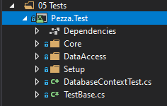
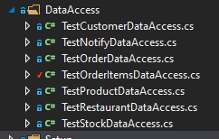
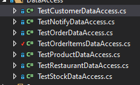
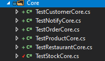
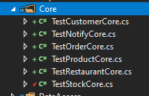

# &nbsp;**Pezza - Phase 2 - Step 2**

<br/><br/>

Unit testing

## **Unit Tests**

Create a New Solution Folder `05 Tests` inside create a new project NUnit Test Project.


The project at the end will look like this



Test Data for our tests. Staying with **Single Responsibility** we want to create a Test Class for every Entity or DTO. Create a folder for every Entity in the Database.


CustomerTestData.cs - We will use Bogus package to help us out in creating Test Data, by creating a Faker Object. You will end up with 3 functions i.e. Entity, DTO and DTOData, the same as you did for StockTestData.


```cs
namespace Pezza.Test
{
    using System;
    using Bogus;
    using Pezza.Common.DTO;
    using Pezza.Common.Entities;

    public static class CustomerTestData
    {
        public static Faker faker = new Faker();

        public static CustomerDTO CustomerDTO = new CustomerDTO()
        {
            ContactPerson = faker.Person.FullName,
            Email = faker.Person.Email,
            Phone = faker.Person.Phone,
            Address = new AddressBase
            {
                Address = faker.Address.FullAddress(),
                City = faker.Address.City(),
                Province = faker.Address.State(),
                PostalCode = faker.Address.PostalCode(),
            },
            DateCreated = DateTime.Now
        };
    }

}
```

Create a Test Data Class for every entity or you can copy it from Phase2/Data.

### **Testing Data Access Layer**

Create a Folder in the Test Project called **DataAccess**. Create a Test Data Access Class for every Entity.



We will test every method inside of the DataAccess class - GetAsync, GetAllAsync, SaveAsync, UpdateAsync and DeleteAsync. The class will inherit from QueryTestBase created earlier.

Every test method will start with [Test], this indicates it as a Unit Test.

It will contain a new Handler declaring a new DataAccess object with the In Memory DBContext. i.e. var handler = new CustomerDataAccess(this.Context);

 The entity passed will be from the Test Data created earlier. i.e.  var entity = CustomerTestData.Customer;

 Next we will Unit Test the Database Call and test the result i.e await handler.SaveAsync(entity);

 This is building on for what was done for TestStockDataAccess

TestCustomerDataAccess.cs

```cs
namespace Pezza.Test
{
    using System.Linq;
    using System.Threading.Tasks;
    using Bogus;
    using NUnit.Framework;
    using Pezza.DataAccess.Data;

    public class TestCustomerDataAccess : QueryTestBase
    {
        [Test]
        public async Task GetAsync()
        {
            var handler = new CustomerDataAccess(this.Context);
            var entity = CustomerTestData.Customer;
            await handler.SaveAsync(entity);

            var response = await handler.GetAsync(entity.Id);

            Assert.IsTrue(response != null);
        }

        [Test]
        public async Task GetAllAsync()
        {
            var handler = new CustomerDataAccess(this.Context);
            var entity = CustomerTestData.Customer;
            await handler.SaveAsync(entity);

            var response = await handler.GetAllAsync();
            var outcome = response.Count();

            Assert.IsTrue(outcome == 1);
        }

        [Test]
        public async Task SaveAsync()
        {
            var handler = new CustomerDataAccess(this.Context);
            var entity = CustomerTestData.Customer;
            var result = await handler.SaveAsync(entity);
            var outcome = result.Id != 0;

            Assert.IsTrue(outcome);
        }

        [Test]
        public async Task UpdateAsync()
        {
            var handler = new CustomerDataAccess(this.Context);
            var entity = CustomerTestData.Customer;
            var originalCustomer = entity;
            await handler.SaveAsync(entity);

            entity.Name = new Faker().Person.FirstName;
            var response = await handler.UpdateAsync(entity);
            var outcome = response.Name.Equals(originalCustomer.Name);

            Assert.IsTrue(outcome);
        }

        [Test]
        public async Task DeleteAsync()
        {
            var handler = new CustomerDataAccess(this.Context);
            var entity = CustomerTestData.Customer;
            await handler.SaveAsync(entity);

            var response = await handler.DeleteAsync(entity.Id);

            Assert.IsTrue(response);
        }
    }
}
```

Create a DataAccess test for every Entity



### **Testing Core Layer**

Create a Folder in the Test Project called **Core**. Create a Test Core Class for every Entity.



We will test every method inside of the Core class - GetAsync, GetAllAsync, SaveAsync, UpdateAsync and DeleteAsync. The class will inherit from QueryTestBase created earlier.

Every test method will start with [Test], this indicates it as a Unit Test.

It will contain a new Handler declaring a new DataAccess object with the In Memory DBContext and AutoMapper. i.e. var handler = new CustomerDataAccess(this.Context, Mapper());

 We will declare a new Handler for every test and inject the DataAccess into it. i.e. var sutCreate = new CreateCustomerCommandHandler(dataAccess);

 Then we will test the Command or Query Handler with the Test Data created earlier i.e. var resultCreate = await sutCreate.Handle(new CreateCustomerCommand
            {
                Data = CustomerTestData.CustomerDataDTO
            }, CancellationToken.None);

 Next we will test the the result.


TestCustomerCore.cs in Core folder
```cs
namespace Pezza.Test.Core
{
    using System.Threading;
    using System.Threading.Tasks;
    using NUnit.Framework;
    using Pezza.Core.Customer.Commands;
    using Pezza.Core.Customer.Queries;
    using Pezza.DataAccess.Data;

    public class TestCustomerCore : QueryTestBase
    {
        [Test]
        public async Task GetAsync()
        {
            var dataAccess = new CustomerDataAccess(this.Context, Mapper());

            //Act
            var sutCreate = new CreateCustomerCommandHandler(dataAccess);
            var resultCreate = await sutCreate.Handle(new CreateCustomerCommand
            {
                Data = CustomerTestData.CustomerDTO
            }, CancellationToken.None);

            //Act
            var sutGet = new GetCustomerQueryHandler(dataAccess);
            var resultGet = await sutGet.Handle(new GetCustomerQuery
            {
                Id = resultCreate.Data.Id
            }, CancellationToken.None);

            Assert.IsTrue(resultGet?.Data != null);
        }

        [Test]
        public async Task GetAllAsync()
        {
            var dataAccess = new CustomerDataAccess(this.Context, Mapper());

            //Act
            var sutCreate = new CreateCustomerCommandHandler(dataAccess);
            var resultCreate = await sutCreate.Handle(new CreateCustomerCommand
            {
                Data = CustomerTestData.CustomerDTO
            }, CancellationToken.None);

            //Act
            var sutGetAll = new GetCustomersQueryHandler(dataAccess);
            var resultGetAll = await sutGetAll.Handle(new GetCustomersQuery(), CancellationToken.None);

            Assert.IsTrue(resultGetAll?.Data.Count == 1);
        }

        [Test]
        public async Task SaveAsync()
        {
            var dataAccess = new CustomerDataAccess(this.Context, Mapper());

            //Act
            var sutCreate = new CreateCustomerCommandHandler(dataAccess);
            var resultCreate = await sutCreate.Handle(new CreateCustomerCommand
            {
                Data = CustomerTestData.CustomerDTO
            }, CancellationToken.None);

            Assert.IsTrue(resultCreate.Succeeded);
        }

        [Test]
        public async Task UpdateAsync()
        {
            var dataAccess = new CustomerDataAccess(this.Context, Mapper());

            //Act
            var sutCreate = new CreateCustomerCommandHandler(dataAccess);
            var resultCreate = await sutCreate.Handle(new CreateCustomerCommand
            {
                Data = CustomerTestData.CustomerDTO
            }, CancellationToken.None);

            //Act
            var sutUpdate = new UpdateCustomerCommandHandler(dataAccess);
            var resultUpdate = await sutUpdate.Handle(new UpdateCustomerCommand
            {
                Data = new Common.DTO.CustomerDTO
                {
                    Id = resultCreate.Data.Id,
                    Phone = "0721230000"
                }
            }, CancellationToken.None);

            //Assert
            Assert.IsTrue(resultUpdate.Succeeded);
        }

        [Test]
        public async Task DeleteAsync()
        {
            var dataAccess = new CustomerDataAccess(this.Context, Mapper());
            //Act
            var sutCreate = new CreateCustomerCommandHandler(dataAccess);
            var resultCreate = await sutCreate.Handle(new CreateCustomerCommand
            {
                Data = CustomerTestData.CustomerDTO
            }, CancellationToken.None);


            //Act
            var sutDelete = new DeleteCustomerCommandHandler(dataAccess);
            var outcomeDelete = await sutDelete.Handle(new DeleteCustomerCommand
            {
                Id = resultCreate.Data.Id
            }, CancellationToken.None);

            //Assert
            Assert.IsTrue(outcomeDelete.Succeeded);
        }
    }
}
```

Create the Core Unit Test classes now, when you are done it should look like this.



To run the test go to the top Menu bar -> Test -> Run All Tests. This will open the Test Explorer.


You should now have 64 Passed Unit Tests


## **STEP 3 - Finishing up the API to use CQRS**

Move to Step 3
[Click Here](https://github.com/entelect-incubator/.NET/tree/master/Phase%202/Step%203)