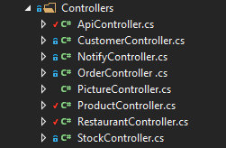
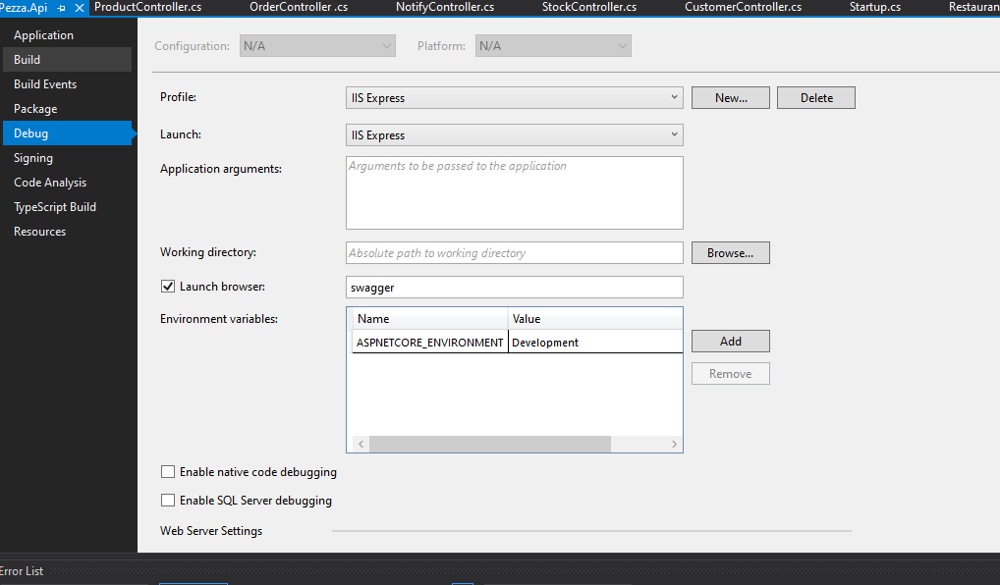

# &nbsp;**Pezza - Phase 2 - Step 3**

<br/><br/>

Finishing up the API to use CQRS

## **API**

Create helper class for you API Project.

Returning clean unified responses to the consumer of your API will be creating an Action Result Helper. Depending on the data retrieve from your Core layer it will cater for the HTTP Response and don't have duplicate code all over the Controllers.

This ensure we always return the same Result Object back to the consumer.

ActionResultHelper.cs

```cs
namespace Pezza.Api.Helpers
{
    using Microsoft.AspNetCore.Mvc;
    using Pezza.Api.Controllers;
    using Pezza.Common.Models;

    public static class ResponseHelper
    {
        public static ActionResult ResponseOutcome<T>(Result<T> result, ApiController controller)
        {
            if (result.Data == null)
            {
                return controller.NotFound(Result.Failure( $"{typeof(T).Name.Replace("DTO","")} not found"));
            }

            if (!result.Succeeded)
            {
                return controller.BadRequest(result);
            }

            return controller.Ok(result);
        }

        public static ActionResult ResponseOutcome<T>(ListResult<T> result, ApiController controller)
        {
            if (!result.Succeeded)
            {
                return controller.BadRequest(result);
            }

            return controller.Ok(result);
        }

        public static ActionResult ResponseOutcome(Result result, ApiController controller)
        {
            if (!result.Succeeded)
            {
                return controller.BadRequest(result);
            }

            return controller.Ok(result);
        }
    }
}
```

We have some images we want to upload for Products and Restaurants. We will be using the Media Helper to Upload and Image onto the server.

MediaHelper.cs

```cs
namespace Pezza.Api.Helpers
{
    using System;
    using System.IO;
    using System.Text.RegularExpressions;
    using System.Threading.Tasks;
    using ImageMagick;
    using Pezza.Common;
    using Pezza.Common.Helpers;
    using Pezza.Common.Models;

    public static class MediaHelper
    {
        public static async Task<Result<UploadMediaResult>> UploadMediaAsync(string uploadFolder, string base64FileData, bool thumbnail = false)
        {
            if (!string.IsNullOrEmpty(base64FileData))
            {
                var folderName = string.IsNullOrEmpty(uploadFolder) ? "" : uploadFolder;

                var pathToSave = Path.Combine(Directory.GetCurrentDirectory(), Path.Combine("Media", folderName));
                if (!Directory.Exists(pathToSave))
                {
                    Directory.CreateDirectory(pathToSave);
                }
                var extension = base64FileData.GetMimeFromBase64().GetExtensionFromMimeType();
                var timestamp = $"{ DateTime.Now:yyyy-MM-dd_HH-mm-ss-fff}";
                var imageFileName = $"{timestamp}{extension}";
                var thumbnailFileName = $"{timestamp}_Thumbnail{extension}";

                var fullPath = Path.Combine(pathToSave, imageFileName);
                var thumbnailFullPath = Path.Combine(pathToSave, thumbnailFileName);

                if (File.Exists(fullPath))
                {
                    File.Delete(fullPath);
                }

                try
                {
                    var base64Data = Regex.Match(base64FileData, @"data:image/(?<type>.+?),(?<data>.+)").Groups["data"].Value;
                    var binData = Convert.FromBase64String(base64Data);

                    await File.WriteAllBytesAsync(fullPath, binData);
                }
                catch (Exception ex)
                {
                    return Result<UploadMediaResult>.Failure(ex.Message);
                }

                if (thumbnail)
                {
                    using var stream = File.Open(fullPath, FileMode.Open);
                    CreateThumbnail(stream, thumbnailFullPath);
                }

                return Result<UploadMediaResult>.Success(new UploadMediaResult
                {
                    FullPath = fullPath,
                    Path = imageFileName,
                    Thumbnail = thumbnailFileName
                });
            }

            return Result<UploadMediaResult>.Failure("No image to upload");
        }

        private static void CreateThumbnail(Stream stream, string thumbnailPath)
        {
            using var mImage = new MagickImage(stream);
            mImage.Sample(new Percentage(10.0));
            mImage.Quality = 60;
            mImage.Density = new Density(60);

            mImage.Write(thumbnailPath);
        }

        public static string GetMimeFromBase64(this string value)
        {
            var match = Regex.Match(value, @"data:(?<type>.+?);base64,(?<data>.+)");
            return match.Groups["type"].Value;
        }

        public static Stream GetStreamFromUrl(string url)
        {
            byte[] imageData = null;

            using (var wc = new System.Net.WebClient())
            {
                imageData = wc.DownloadData(url);
            }

            return new MemoryStream(imageData);
        }
    }
}
```

MimeTypes.cs copy from Phase2\Data is a Helper Class handling file mime types.

To show negative errors results inside of Swagger UI we need to create ErrorResult class overwriting the Succeeded property with a default value. This helps if and external person integrated with you to see the negative journeys more clearly.

ErrorResult.cs

```cs
namespace Pezza.Api.Helpers
{
    using System.ComponentModel;
    using Pezza.Common.Models;

    public class ErrorResult : Result
    {

        public ErrorResult() => this.Succeeded = false;

        [DefaultValue(false)]
        public new bool Succeeded { get; set; }
    }
}

```

Helpers should like this when you are.


## **STEP 3 - Finishing the API Controller**

### **Base Api Controller** Will be used to inject Mediatr into all other Controllers


ApiController.cs

```cs
namespace Pezza.Api.Controllers
{
    using MediatR;
    using Microsoft.AspNetCore.Mvc;
    using Microsoft.Extensions.DependencyInjection;
    
    [ApiController]
    [Route("api/[controller]")]
    [Produces("application/json")]
    public abstract class ApiController : ControllerBase
    {
        private IMediator mediator;

        protected IMediator Mediator => this.mediator ??= this.HttpContext.RequestServices.GetService<IMediator>();
    }
}
```

Now let's modify the Stock Controller to use Mediatr. 

Inherit from the ApiController instead of ControllerBase

```cs
public class StockController : ApiController
```

Modify all the functions to use Mediatr and the new DataDTO's

```cs
namespace Pezza.Api.Controllers
{
    using System.Threading.Tasks;
    using Microsoft.AspNetCore.Mvc;
    using Pezza.Api.Helpers;
    using Pezza.Common.DTO;
    using Pezza.Common.Models;
    using Pezza.Core.Customer.Commands;
    using Pezza.Core.Customer.Queries;

    [ApiController]
    public class CustomerController : ApiController
    {
        /// <summary>
        /// Get Customer by Id.
        /// </summary>
        /// <param name="id">int.</param>
        /// <returns>A <see cref="Task"/> representing the asynchronous operation.</returns>
        /// <response code="200">Get a customer</response>
        /// <response code="400">Error getting a customer</response>
        /// <response code="404">Customer not found</response>
        [HttpGet("{id}")]
        [ProducesResponseType(typeof(Result<CustomerDTO>), 200)]
        [ProducesResponseType(typeof(ErrorResult), 400)]
        [ProducesResponseType(typeof(ErrorResult), 404)]
        public async Task<ActionResult> GetCustomer(int id)
        {
            var result = await this.Mediator.Send(new GetCustomerQuery { Id = id });
            return ResponseHelper.ResponseOutcome(result, this);
        }

        /// <summary>
        /// Get all Customers.
        /// </summary>
        /// <returns>A <see cref="Task"/> repres
        /// enting the asynchronous operation.</returns>
        /// <response code="200">Customer Search</response>
        /// <response code="400">Error searching for customers</response>
        [HttpPost]
        [ProducesResponseType(typeof(ListResult<CustomerDTO>), 200)]
        [ProducesResponseType(typeof(ErrorResult), 400)]
        [Route("Search")]
        public async Task<ActionResult> Search()
        {
            var result = await this.Mediator.Send(new GetCustomersQuery());
            return ResponseHelper.ResponseOutcome(result, this);
        }

        /// <summary>
        /// Create Customer.
        /// </summary>
        /// <remarks>
        /// Sample request:
        ///     POST api/Customer
        ///     {
        ///       "name": "Person A",
        ///       "address": "1 Tree Street",
        ///       "city": "Pretoria",
        ///       "province": "Gautenf",
        ///       "PostalCode": "0181",
        ///       "phone": "0721230000",
        ///       "email": "person.a@gmail.com"
        ///       "contactPerson": "Person B 0723210000"
        ///     }.
        /// </remarks>
        /// <param name="customer">CustomerDTO.</param>
        /// <returns>A <see cref="Task"/> representing the asynchronous operation.</returns>
        /// <response code="200">Customer created</response>
        /// <response code="400">Error creating a customer</response>
        [HttpPost]
        [ProducesResponseType(typeof(Result<CustomerDTO>), 200)]
        [ProducesResponseType(typeof(ErrorResult), 400)]
        public async Task<ActionResult<CustomerDTO>> Create(CustomerDTO customer)
        {
            var result = await this.Mediator.Send(new CreateCustomerCommand
            {
                Data = customer
            });

            return ResponseHelper.ResponseOutcome(result, this);
        }

        /// <summary>
        /// Update Customer.
        /// </summary>
        /// <remarks>
        /// Sample request:
        ///     PUT api/Customer
        ///     {
        ///       "id": 1,
        ///       "name": "Person A",
        ///       "address": "1 Tree Street",
        ///       "city": "Pretoria",
        ///       "province": "Gautenf",
        ///       "PostalCode": "0181",
        ///       "phone": "0721230000",
        ///       "email": "person.a@gmail.com"
        ///       "contactPerson": "Person B 0723210000"
        ///     }.
        /// </remarks>
        /// <param name="customer">CustomerDTO.</param>
        /// <returns>A <see cref="Task"/> representing the asynchronous operation.</returns>
        /// <response code="200">Customer updated</response>
        /// <response code="400">Error updating a customer</response>
        /// <response code="404">Customer not found</response>
        [HttpPut]
        [ProducesResponseType(typeof(Result<CustomerDTO>), 200)]
        [ProducesResponseType(typeof(ErrorResult), 400)]
        [ProducesResponseType(typeof(Result), 404)]
        public async Task<ActionResult> Update(CustomerDTO customer)
        {
            var result = await this.Mediator.Send(new UpdateCustomerCommand
            {
                Data = customer
            });

            return ResponseHelper.ResponseOutcome(result, this);
        }

        /// <summary>
        /// Remove Customer by Id.
        /// </summary>
        /// <param name="id">int.</param>
        /// <returns>A <see cref="Task"/> representing the asynchronous operation.</returns>
        /// <response code="200">Customer deleted</response>
        /// <response code="400">Error deleting a customer</response>
        [HttpDelete("{id}")]
        [ProducesResponseType(typeof(Result), 200)]
        [ProducesResponseType(typeof(ErrorResult), 400)]
        public async Task<ActionResult> Delete(int id)
        {
            var result = await this.Mediator.Send(new DeleteCustomerCommand { Id = id });
            return ResponseHelper.ResponseOutcome(result, this);
        }
    }
}
```

To upload images add the following snippet. ImageData will be a Base64 String from the front end calling application. 

```cs
if (!string.IsNullOrEmpty(data.ImageData))
{
    var imageResult = await MediaHelper.UploadMediaAsync("restaurant", data.ImageData);
    if (imageResult != null)
    {
        data.PictureUrl = imageResult.Data.Path;
    }
}
```

To view uploaded images create a PictureController. When the image is not found it will return a not found image. Add one into Assets, one can be found in the Data folder.


Remember to Right Click on the Image and choose Properties. Change Copy to Output to Copy Always.


```cs
namespace Pezza.Api.Controllers
{
    using System.IO;
    using Microsoft.AspNetCore.Mvc;
    using Pezza.Common;

    public class PictureController : ApiController
    {
        /// <summary>
        /// Uploads the specified dto.
        /// </summary>
        /// <param name="file">File.</param>
        /// <param name="folder">Folder.</param>
        /// <param name="thumbnail">Return thumbnail or not.</param>
        /// <returns>HttpResponseMessage.</returns>
        [HttpGet]
        [ProducesResponseType(200)]
        [ResponseCache(Duration = 0, Location = ResponseCacheLocation.None, NoStore = true)]
        public IActionResult Get(string file, string folder = "", bool thumbnail = false)
        {
            if (!string.IsNullOrEmpty(folder))
            {
                file = @$"{folder}\{file}";
            }

            if (string.IsNullOrEmpty(file))
            {
                return this.ReturnNotFoundImage();
            }

            var path = Path.Combine(Directory.GetCurrentDirectory(), Path.Combine("Media", file));

            if (thumbnail)
            {
                var extension = Path.GetExtension(path);
                path = path.Replace(extension, extension.Replace(".", "_Thumbnail."));
            }

            if (!System.IO.File.Exists(path))
            {
                return this.ReturnNotFoundImage();
            }
            else
            {
                path = path.Replace("_Thumbnail", string.Empty);
            }

            if (!System.IO.File.Exists(path))
            {
                return this.ReturnNotFoundImage();
            }

            var mimetype = MimeTypeMap.GetMimeType(Path.GetExtension(path));

            var stream = new FileStream(path, FileMode.Open);
            return new FileStreamResult(stream, mimetype);
        }

        /// <summary>
        /// Returns the not found image.
        /// </summary>
        /// <returns>Not found image.</returns>
        private IActionResult ReturnNotFoundImage()
        {
            var imgPath = Path.Combine(Directory.GetCurrentDirectory(), "Assets/not-found.png");
            var stream = new FileStream(imgPath, FileMode.Open);
            return new FileStreamResult(stream, "image/png");
        }
    }
}
```

Complete all the other Controllers



Right-Click on you Pezza.Api project -> Properties -> Debug.

Change Launch Browser to Open "swagger"



Startup.cs should look like this when you are done.

```cs
namespace Pezza.Api
{
    using System;
    using System.IO;
    using System.Reflection;
    using Microsoft.AspNetCore.Builder;
    using Microsoft.AspNetCore.Hosting;
    using Microsoft.AspNetCore.Http;
    using Microsoft.EntityFrameworkCore;
    using Microsoft.Extensions.Configuration;
    using Microsoft.Extensions.DependencyInjection;
    using Microsoft.Extensions.FileProviders;
    using Microsoft.Extensions.Hosting;
    using Microsoft.OpenApi.Models;
    using Pezza.Core;
    using Pezza.DataAccess;

    public class Startup
    {
        public Startup(IConfiguration configuration)
        {
            this.Configuration = configuration;
        }

        public IConfiguration Configuration { get; }

        public void ConfigureServices(IServiceCollection services)
        {
            services.AddControllers();
            services.AddSwaggerGen(c =>
            {
                c.SwaggerDoc("v1", new OpenApiInfo
                {
                    Title = "Stock API",
                    Version = "v1"
                });

                var xmlFile = $"{Assembly.GetExecutingAssembly().GetName().Name}.xml";
                var xmlPath = Path.Combine(AppContext.BaseDirectory, xmlFile);
                c.IncludeXmlComments(xmlPath);
            });

            // Add DbContext using SQL Server Provider
            services.AddDbContext<DatabaseContext>(options =>
                options.UseSqlServer(this.Configuration.GetConnectionString("PezzaDatabase"))
            );

            DependencyInjection.AddApplication(services);
        }

        public void Configure(IApplicationBuilder app, IWebHostEnvironment env)
        {
            if (env.IsDevelopment())
            {
                app.UseDeveloperExceptionPage();
            }

            // Enable middleware to serve generated Swagger as a JSON endpoint.
            app.UseSwagger();
            // Enable middleware to serve swagger-ui (HTML, JS, CSS, etc.),
            // specifying the Swagger JSON endpoint.
            app.UseSwaggerUI(c =>
            {
                c.SwaggerEndpoint("/swagger/v1/swagger.json", "Stock API V1");
            });

            app.UseHttpsRedirection();

            app.UseRouting();

            app.UseAuthorization();

            app.UseEndpoints(endpoints =>
            {
                endpoints.MapControllers();
            });

            app.UseStaticFiles(new StaticFileOptions
            {
                FileProvider = new PhysicalFileProvider(Path.Combine(Directory.GetCurrentDirectory(), @"Media")),
                RequestPath = new PathString("/Media"),
            });
        }
    }
}
```

Press F5 and Run your API. You should see something like this. 


### You are done with the Back-End that will be used to build most of the Front-End stack.

## **Move to Phase 3**

[Click Here](https://github.com/entelect-incubator/.NET/tree/master/Phase%203)