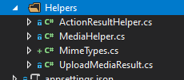
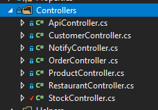
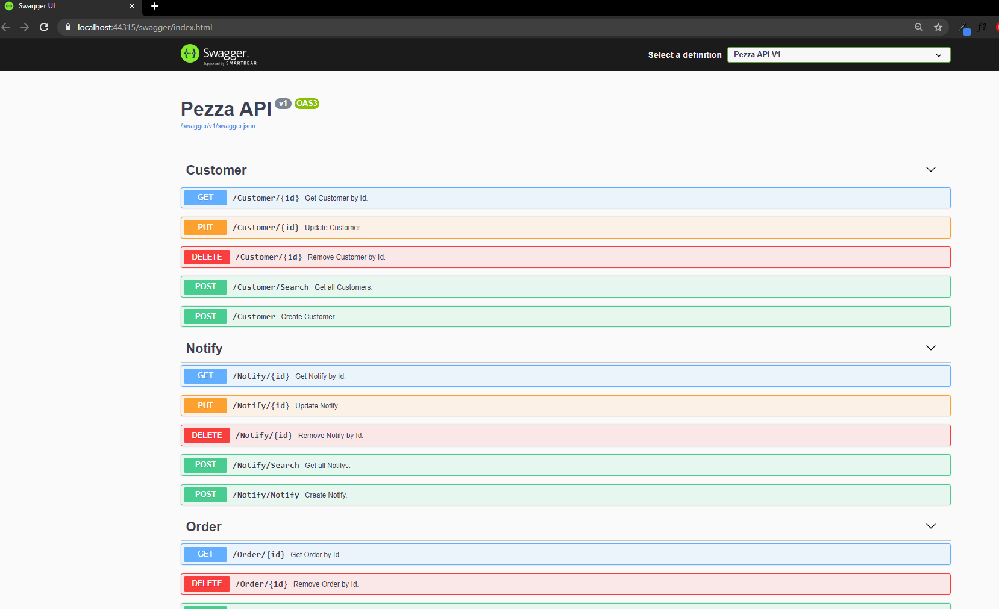

# &nbsp;**Pezza - Phase 2 - Step 3**

<br/><br/>

Finishing up the API to use CQRS

## **API**

Create helper class for you API Project.

Returning clean unified responses to the consumer of your API will be creating an Action Result Helper. Depending on the data retrieve from your Core layer it will cater for the HTTP Response and don't have duplicate code all over the Controllers.

ActionResultHelper.cs

```cs
namespace Pezza.Api.Helpers
{
    using Microsoft.AspNetCore.Mvc;
    using Pezza.Api.Controllers.CleanArchitecture.WebUI.Controllers;
    using Pezza.Common.Models;

    public static class ResponseHelper
    {
        public static ActionResult ResponseOutcome<T>(Result<T> result, ApiController controller)
        {
            if (result.Data == null)
            {
                return controller.NotFound();
            }

            if (!result.Succeeded)
            {
                return controller.BadRequest(result.Errors);
            }

            return controller.Ok(result.Data);
        }

        public static ActionResult ResponseOutcome<T>(ListResult<T> result, ApiController controller)
        {
            if (!result.Succeeded)
            {
                return controller.BadRequest(result.Errors);
            }

            return controller.Ok(result.Data);
        }

        public static ActionResult ResponseOutcome(Result result, ApiController controller)
        {
            if (!result.Succeeded)
            {
                return controller.BadRequest(result.Errors);
            }

            return controller.Ok(result.Succeeded);
        }
    }
}
```

We have some images we want to upload for Products and Restaurants. We will be using the Media Helper to Upload and Image onto the server.

MediaHelper.cs

```cs
namespace Pezza.Api.Helpers
{
    using System;
    using System.IO;
    using System.Text.RegularExpressions;
    using System.Threading.Tasks;
    using ImageMagick;
    using Pezza.Common;
    using Pezza.Common.Models;

    public static class MediaHelper
    {
        public static async Task<Result<UploadMediaResult>> UploadMediaAsync(string uploadFolder, string fileData)
        {
            if (string.IsNullOrEmpty(fileData))
            {
                var folderName = string.IsNullOrEmpty( uploadFolder) ? "" : uploadFolder;

                var pathToSave = Path.Combine(Directory.GetCurrentDirectory(), Path.Combine("Media", folderName));
                if (!Directory.Exists(pathToSave))
                {
                    Directory.CreateDirectory(pathToSave);
                }
                var extension = fileData.GetMimeFromBase64().GetExtensionFromMimeType();
                var timestamp = $"{ DateTime.Now:yyyy-MM-dd_HH-mm-ss-fff}";
                var imageFileName = $"{timestamp}{extension}";
                var thumbnailFileName = $"{timestamp}_Thumbnail{extension}";

                var fullPath = Path.Combine(pathToSave, imageFileName);
                var thumbnailFullPath = Path.Combine(pathToSave, thumbnailFileName);

                if (File.Exists(fullPath))
                {
                    File.Delete(fullPath);
                }

                try
                {
                    var base64Data = Regex.Match(fileData, @"data:image/(?<type>.+?),(?<data>.+)").Groups["data"].Value;
                    var binData = Convert.FromBase64String(base64Data);

                    await File.WriteAllBytesAsync(fullPath, binData);
                }
                catch (Exception ex)
                {
                    return Result<UploadMediaResult>.Failure(ex.Message);
                }

                CompressImage(fullPath);
                CreateThumbnail(fullPath, thumbnailFullPath);

                var relativeName = Path.Combine(folderName, imageFileName);
                var relativeThumnailName = Path.Combine(folderName, thumbnailFileName);

                return Result<UploadMediaResult>.Success(new UploadMediaResult
                {
                    FullPath = fullPath,
                    RelativePath = relativeName,
                    Thumbnail = relativeThumnailName
                });
            }

            return Result<UploadMediaResult>.Failure("No image to upload");
        }

        private static void CompressImage(string path)
        {
            var newImage = new FileInfo(path);
            var optimizer = new ImageOptimizer();
            optimizer.LosslessCompress(newImage);
            optimizer.Compress(newImage);
            newImage.Refresh();
        }

        private static void CreateThumbnail(string originalPath, string thumbnailPath)
        {
            using var mImage = new MagickImage(originalPath);
            mImage.Sample(new Percentage(10.0));
            mImage.Quality = 82;
            mImage.Density = new Density(72);

            mImage.Write(thumbnailPath);
        }

        public static string GetMimeFromBase64(this string value)
        {
            var match = Regex.Match(value, @"data:(?<type>.+?);base64,(?<data>.+)");
            return match.Groups["type"].Value;
        }
    }
}
```

UploadMediaResult.cs is a model used by MediaHelper.cs

```cs
namespace Pezza.Api.Helpers
{
    public class UploadMediaResult
    {
        public string FullPath { get; set; }

        public string RelativePath { get; set; }

        public string Thumbnail { get; set; }
    }
}
```

MimeTypes.cs copy from Phase2\Data is a Helper Class handling file mime types.

Helpers should like this when you are.



## **STEP 3 - Finishing the API Controller**

### **Base Api Controller** Will be used to inject Mediatr into all other Controllers


ApiController.cs

```cs
namespace Pezza.Api.Controllers
{
    using MediatR;
    using Microsoft.AspNetCore.Mvc;
    using Microsoft.Extensions.DependencyInjection;

    namespace CleanArchitecture.WebUI.Controllers
    {
        [ApiController]
        [Route("api/[controller]")]
        public abstract class ApiController : ControllerBase
        {
            private IMediator mediator;

            protected IMediator Mediator => this.mediator ??= this.HttpContext.RequestServices.GetService<IMediator>();
        }
    }
}
```

Now let's modify the Stock Controller to use Mediatr. 

Inherit from the ApiController instead of ControllerBase

```cs
public class StockController : ApiController
```

Modify all the functions to use Mediatr and the new DataDTO's

```cs
namespace Pezza.Api.Controllers
{
    using System.Threading.Tasks;
    using Microsoft.AspNetCore.Mvc;
    using Pezza.Api.Controllers.CleanArchitecture.WebUI.Controllers;
    using Pezza.Api.Helpers;
    using Pezza.Common.DTO;
    using Pezza.Core.Customer.Commands;
    using Pezza.Core.Customer.Queries;

    [ApiController]
    public class CustomerController : ApiController
    {
        /// <summary>
        /// Get Customer by Id.
        /// </summary>
        /// <param name="id"></param> 
        [HttpGet("{id}")]
        [ProducesResponseType(200)]
        [ProducesResponseType(400)]
        [ProducesResponseType(404)]
        public async Task<ActionResult> GetCustomer(int id)
        {
            var result = await this.Mediator.Send(new GetCustomerQuery { Id = id });

            return ResponseHelper.ResponseOutcome<CustomerDTO>(result, this);
        }

        /// <summary>
        /// Get all Customers.
        /// </summary>
        [HttpPost]
        [ProducesResponseType(200)]
        [ProducesResponseType(400)]
        [Route("Search")]
        public async Task<ActionResult> Search()
        {
            var result = await this.Mediator.Send(new GetCustomersQuery());

            return ResponseHelper.ResponseOutcome<CustomerDTO>(result, this);
        }

        /// <summary>
        /// Create Customer.
        /// </summary>
        /// <remarks>
        /// Sample request:
        /// 
        ///     POST api/Customer
        ///     {        
        ///       "name": "Person A",
        ///       "address": "1 Tree Street",
        ///       "city": "Pretoria",
        ///       "province": "Gautenf",
        ///       "zipCode": "0181",
        ///       "phone": "0721230000",
        ///       "email": "person.a@gmail.com"
        ///       "contactPerson": "Person B 0723210000"
        ///     }
        /// </remarks>
        /// <param name="customer"></param> 
        [HttpPost]
        [ProducesResponseType(200)]
        [ProducesResponseType(400)]
        public async Task<ActionResult<CustomerDTO>> Create(CustomerDataDTO customer)
        {
            var result = await this.Mediator.Send(new CreateCustomerCommand
            {
                Data = customer
            });

            return ResponseHelper.ResponseOutcome<CustomerDTO>(result, this);
        }

        /// <summary>
        /// Update Customer.
        /// </summary>
        /// <remarks>
        /// Sample request:
        /// 
        ///     PUT api/Customer/1
        ///     {        
        ///       "name": "Person A",
        ///       "address": "1 Tree Street",
        ///       "city": "Pretoria",
        ///       "province": "Gautenf",
        ///       "zipCode": "0181",
        ///       "phone": "0721230000",
        ///       "email": "person.a@gmail.com"
        ///       "contactPerson": "Person B 0723210000"
        ///     }
        /// </remarks>
        /// <param name="id"></param>
        /// <param name="customer"></param>
        [HttpPut("{id}")]
        [ProducesResponseType(200)]
        [ProducesResponseType(400)]
        [ProducesResponseType(404)]
        public async Task<ActionResult> Update(int id, CustomerDataDTO customer)
        {
            var result = await this.Mediator.Send(new UpdateCustomerCommand
            {
                Id = id,
                Data = customer
            });

            return ResponseHelper.ResponseOutcome<CustomerDTO>(result, this);
        }

        /// <summary>
        /// Remove Customer by Id.
        /// </summary>
        /// <param name="id"></param>
        [HttpDelete("{id}")]
        [ProducesResponseType(200)]
        [ProducesResponseType(400)]
        public async Task<ActionResult> Delete(int id)
        {
            var result = await this.Mediator.Send(new DeleteCustomerCommand { Id = id });

            return ResponseHelper.ResponseOutcome(result, this);
        }
    }
}
```

To upload images add the following snippet. ImageData will be a Base64 String from the front end calling application.

```cs
var imageResult = await MediaHelper.UploadMediaAsync("restaurant", data.ImageData);
if (imageResult != null)
{
    data.PictureUrl = imageResult.Data.RelativePath;
}
```

Complete all the other Controllers



Right-Click on you Pezza.Api project -> Debug.

Change Launch Browser to Open "swagger"


Startup.cs should look like this when you are done.

```cs
namespace Pezza.Api
{
    using System;
    using System.IO;
    using System.Reflection;
    using Microsoft.AspNetCore.Builder;
    using Microsoft.AspNetCore.Hosting;
    using Microsoft.AspNetCore.ResponseCompression;
    using Microsoft.EntityFrameworkCore;
    using Microsoft.Extensions.Configuration;
    using Microsoft.Extensions.DependencyInjection;
    using Microsoft.Extensions.Hosting;
    using Microsoft.OpenApi.Models;
    using Pezza.Core;
    using Pezza.DataAccess;
    using Pezza.DataAccess.Contracts;

    public class Startup
    {
        public Startup(IConfiguration configuration)
        {
            this.Configuration = configuration;
        }

        public IConfiguration Configuration { get; }

        public void ConfigureServices(IServiceCollection services)
        {
            services.AddResponseCompression(options =>
            {
                options.Providers.Add<BrotliCompressionProvider>();
                options.Providers.Add<GzipCompressionProvider>();
            });
            services.AddResponseCompression();

            services.AddControllers();

            services.AddSwaggerGen(c =>
            {
                c.SwaggerGeneratorOptions.IgnoreObsoleteActions = true;
                c.SwaggerDoc("v1", new OpenApiInfo
                {
                    Title = "Pezza API",
                    Version = "v1"
                });

                var xmlFile = $"{Assembly.GetExecutingAssembly().GetName().Name}.xml";
                var xmlPath = Path.Combine(AppContext.BaseDirectory, xmlFile);
                c.IncludeXmlComments(xmlPath);
            });

            // Add DbContext using SQL Server Provider
            services.AddDbContext<IDatabaseContext, DatabaseContext>(options =>
                options.UseSqlServer(this.Configuration.GetConnectionString("PezzaDatabase"))
            );

            services.AddCors(options =>
            {
                options.AddPolicy("CorsPolicy",
                    builder => builder.AllowAnyOrigin()
                        .AllowAnyMethod()
                        .AllowAnyHeader());
            });

            DependencyInjection.AddApplication(services);
        }

        public void Configure(IApplicationBuilder app, IWebHostEnvironment env)
        {
            if (env.IsDevelopment())
            {
                app.UseDeveloperExceptionPage();
            }

            app.UseSwagger();

            app.UseSwaggerUI(c =>
            {
                c.SwaggerEndpoint("/swagger/v1/swagger.json", "Pezza API V1");
            });

            app.UseHttpsRedirection();

            app.UseRouting();

            app.UseAuthorization();

            app.UseEndpoints(endpoints =>
            {
                endpoints.MapControllers();
            });
        }
    }
}
```

Press F5 and Run your API. You should see something like this. 



## Move to Step 3
[Click Here](https://github.com/entelect-incubator/.NET/tree/master/Phase%202/Step%203)