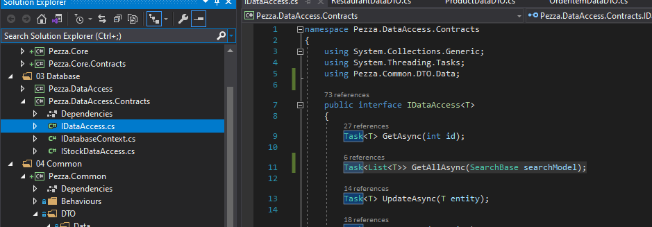

# &nbsp;**Pezza - Phase 3 - Step 2**

<br/><br/>

## **Search Models**

Extend our data DTO's to cater for filtering and pagination. In Pezza.Common Models create PagingArgs.cs


```cs
namespace Pezza.Common.Models
{
    public class PagingArgs
    {
        private int limit = 20;

        public static PagingArgs NoPaging => new PagingArgs { UsePaging = false };

        public static PagingArgs Default => new PagingArgs { UsePaging = true, Limit = 20, Offset = 0 };

        public static PagingArgs FirstItem => new PagingArgs { UsePaging = true, Limit = 1, Offset = 0 };

        public int Offset { get; set; }

        public int Limit
        {
            get => this.limit;

            set
            {
                if (value == 0)
                {
                    value = 20;
                }

                this.limit = value;
            }
        }

        public bool UsePaging { get; set; }
    }
}
```

Add Extensions method in Pezza.Common to do the Pagination. Create a new Folder Extensions in Pezza.Common with Extensions.cs

```cs
using System.Linq;
using Park.Entities.Model;

namespace Park.Common.Extensions
{
    public static class Extensions
    {
        public static IQueryable<T> ApplyPaging<T>(this IQueryable<T> query, PagingArgs pagingArgs)
        {
            var myPagingArgs = pagingArgs;

            if (pagingArgs == null)
            {
                myPagingArgs = PagingArgs.Default;
            }

            return myPagingArgs.UsePaging ? query.Skip(myPagingArgs.Offset).Take(myPagingArgs.Limit) : query;
        }
    }
}
```

Every DataDTO in Pezza.Common extend to include OrdeBy and PagingArgs.


Cerate a new SearchBase.cs in Pezza.Common\DTO\Data

```cs
namespace Pezza.Common.DTO.Data
{
    using Pezza.Common.Models;

    public class SearchBase
    {
        public string OrderBy { get; set; }

        public PagingArgs PagingArgs { get; set; }
    }
}
```

Extend ImageDataBase with SearchBase.

```cs
namespace Pezza.Common.Entities
{
    using Pezza.Common.DTO.Data;

    public class ImageDataBase : SearchBase
    {
        public string ImageData { get; set; }
    }
}
```

Every Data DTO that does not extend ImageBase extend it with SearchBase


```cs
namespace Pezza.Common.DTO
{
    using Pezza.Common.DTO.Data;
    using Pezza.Common.Entities;

    public class CustomerDataDTO : SearchBase
    {
        public string Name { get; set; }

        public string Phone { get; set; }

        public string Email { get; set; }

        public string ContactPerson { get; set; }

        public AddressBase Address { get; set; }
    }
}
```

### **Add filtering**

Create a Filter class for every entity, these filters uses fluent design for readability. In each filter you create a rule for every property that you want to filter on. If that property has a value it builds up a query before executing it to the database. See it as building up a SQL WHERE clause.

Create a CustomerFilter.cs in Pezza.Common Filter

```cs
namespace Test.DataAccess.Filter
{
    using System;
    using System.Linq;
    using Pezza.Common.Entities;

    public static class CustomerFilter
    {
        public static IQueryable<Customer> FilterByName(this IQueryable<Customer> query, string name)
        {
            if (string.IsNullOrWhiteSpace(name))
            {
                return query;
            }

            return query.Where(x => x.Name.Contains(name));
        }

        public static IQueryable<Customer> FilterByAddress(this IQueryable<Customer> query, string address)
        {
            if (string.IsNullOrWhiteSpace(address))
            {
                return query;
            }

            return query.Where(x => x.Address.Contains(address));
        }

        public static IQueryable<Customer> FilterByCity(this IQueryable<Customer> query, string city)
        {
            if (string.IsNullOrWhiteSpace(city))
            {
                return query;
            }

            return query.Where(x => x.City.Contains(city));
        }

        public static IQueryable<Customer> FilterByProvince(this IQueryable<Customer> query, string province)
        {
            if (string.IsNullOrWhiteSpace(province))
            {
                return query;
            }

            return query.Where(x => x.Province.Contains(province));
        }

        public static IQueryable<Customer> FilterByZipCode(this IQueryable<Customer> query, string zipCode)
        {
            if (string.IsNullOrWhiteSpace(zipCode))
            {
                return query;
            }

            return query.Where(x => x.ZipCode.Contains(zipCode));
        }

        public static IQueryable<Customer> FilterByPhone(this IQueryable<Customer> query, string phone)
        {
            if (string.IsNullOrWhiteSpace(phone))
            {
                return query;
            }

            return query.Where(x => x.Phone.Contains(phone));
        }

        public static IQueryable<Customer> FilterByEmail(this IQueryable<Customer> query, string email)
        {
            if (string.IsNullOrWhiteSpace(email))
            {
                return query;
            }

            return query.Where(x => x.Email.Contains(email));
        }

        public static IQueryable<Customer> FilterByContactPerson(this IQueryable<Customer> query, string contactPerson)
        {
            if (string.IsNullOrWhiteSpace(contactPerson))
            {
                return query;
            }

            return query.Where(x => x.ContactPerson.Contains(contactPerson));
        }

        public static IQueryable<Customer> FilterByDateCreated(this IQueryable<Customer> query, DateTime? dateCreated)
        {
            if (!dateCreated.HasValue)
            {
                return query;
            }

            return query.Where(x => x.DateCreated == dateCreated.Value);
        }


    }
}
```

You can also copy the other Filters from Step3\Data\Filter


### **Extend Lst Result**

In Pezza.Commmon Models Result.cs add a new Count Property to List Result.

```cs
 public int Count { get; set; }
```

And the contructor

```cs
internal ListResult(bool succeeded, IEnumerable<T> data, int count, List<string> errors)
{
    this.Succeeded = succeeded;
    this.Errors = errors;
    this.Data = data.ToList();
    this.Count = count;
}
```

And Success

```cs
public static ListResult<T> Success(IEnumerable<T> data, int count) => new ListResult<T>(true, data, count, new List<string> { });
```

### **Add Filters to the Data Acccess**

Change the Data Access Interface to include the Search Model in GetAllAsync.



```
Task<ListResult<T>> GetAllAsync(SearchBase searchModel);
```

## **STEP 2 - Filtering & Searching**


Move to Step 2
[Click Here](https://github.com/entelect-incubator/.NET/tree/master/Phase%203/Step%202)