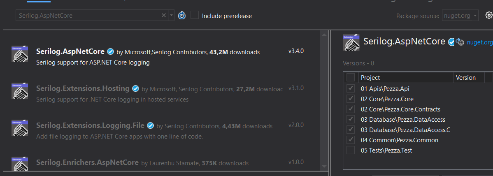

# &nbsp;**Pezza - Phase 4 - Step 2** [](https://github.com/entelect-incubator/.NET/actions/workflows/dotnet-phase4-step2.yml)

<br/><br/>

Install Nuget Package Serilog.AspNetCore and Serilog.Sinks.File



Error handling

In Pezza.Common create Logging.cs

```cs
namespace Pezza.Common
{
    using System;
    using Serilog;

    public static class Logging
    {
        public static void LogInfo(string name, object data)
        {
            Setup();
            Log.Information(name, data);
        }

        public static void LogException(Exception e)
        {
            Setup();
            Log.Fatal(e, "Exception");
        }

        private static void Setup() => Log.Logger = new LoggerConfiguration()
            .Enrich.FromLogContext()
            .WriteTo.File(@"logs\log.txt", rollingInterval: RollingInterval.Day)
            .CreateLogger();
    }
}
```

## **Global Error handling**

Modify ExceptionHandlerMiddleware.cs

Add Logging to HandleExceptionAsync function

```cs
else
{
    var code = HttpStatusCode.InternalServerError;
    var result = JsonConvert.SerializeObject(new { isSuccess = false, error = exception.Message });
    context.Response.ContentType = "application/json";
    context.Response.StatusCode = (int)code;
    Common.Logging.Logging.LogException(exception);

    return context.Response.WriteAsync(result);
}
```

Update PerformanceBehaviour.cs

Replace this.logger.LogInformation with the new Logger

```cs
namespace Pezza.Common.Behaviours
{
    using System.Diagnostics;
    using System.Threading;
    using System.Threading.Tasks;
    using MediatR;
    using Microsoft.Extensions.Logging;
    using Pezza.Common.Interfaces;

    public class PerformanceBehaviour<TRequest, TResponse> : IPipelineBehavior<TRequest, TResponse>
    {
        private readonly Stopwatch timer;
        private readonly ICurrentUserService currentUserService;
        private readonly IIdentityService identityService;

        public PerformanceBehaviour(ICurrentUserService currentUserService, IIdentityService identityService)
        {
            this.timer = new Stopwatch();

            this.currentUserService = currentUserService;
            this.identityService = identityService;
        }

        public async Task<TResponse> Handle(TRequest request, CancellationToken cancellationToken, RequestHandlerDelegate<TResponse> next)
        {
            this.timer.Start();

            var response = await next();

            this.timer.Stop();

            var elapsedMilliseconds = this.timer.ElapsedMilliseconds;

            if (elapsedMilliseconds > 500)
            {
                var requestName = typeof(TRequest).Name;
                var userId = this.currentUserService.UserId ?? string.Empty;
                var userName = string.Empty;

                if (!string.IsNullOrEmpty(userId))
                {
                    userName = await this.identityService.GetUserNameAsync(userId);
                }

                Logging.LogInfo($"CleanArchitecture Long Running Request: {requestName} ({elapsedMilliseconds} milliseconds) {userId} {userName}", request);
            }

            return response;
        }
    }
}
```

With Serilog you can different hooks into i.e. Elastic etc.

Using a Static class for Logging makes it easier to add Logging and don't have to inject it before able to use it.


## **Move to Phase 5**

[Click Here](https://github.com/entelect-incubator/.NET/tree/master/Phase%205) 