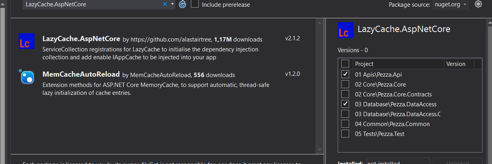

# &nbsp;**Pezza - Phase 5 - Step 1**

<br/><br/>

Caching

## **Install Lazy Cache**

Install Nuget Package LazyCache.AspNetCore on API and DataAcess Project



### **Dependency Injection**

In Pezza.API Startup.cs ConfigureServices() add

```cs
services.AddLazyCache();
```

This will inject IAppCache throughout your application.

Modify the Restaurant Data Access. Remove the filters, because we won't be using that.

Add CacheBust property to RestaurantDataDTO

```cs
public bool BustCache { get; set; } = false;
```

This will cache the request to memory if it doesn't exists. When you change anything on the database it will bust the cache.

```cs
namespace Pezza.DataAccess.Data
{
    using System;
    using System.Collections.Generic;
    using System.Linq;
    using System.Linq.Dynamic.Core;
    using System.Threading.Tasks;
    using LazyCache;
    using Microsoft.EntityFrameworkCore;
    using Pezza.Common.DTO;
    using Pezza.Common.DTO.Data;
    using Pezza.Common.Entities;
    using Pezza.Common.Extensions;
    using Pezza.Common.Models;
    using Pezza.DataAccess.Contracts;

    public class RestaurantDataAccess : IDataAccess<Restaurant>
    {
        private readonly IAppCache cache;
        private readonly string cacheKey = "RestaurantList";
        private readonly TimeSpan cacheExpiry = new TimeSpan(12, 0, 0); ////12 hours
        private readonly IDatabaseContext databaseContext;
        private int count = 0;

        public RestaurantDataAccess(IDatabaseContext databaseContext, IAppCache cache)
            => (this.databaseContext, this.cache) = (databaseContext, cache);

        public async Task<Restaurant> GetAsync(int id)
        {
            return await this.databaseContext.Restaurants.FirstOrDefaultAsync(x => x.Id == id);
        }

        public async Task<ListResult<Restaurant>> GetAllAsync(SearchBase searchBase)
        {
            var searchModel = (RestaurantDataDTO)searchBase;
            if (searchModel.BustCache)
            {
                this.ClearPageCache();
            }

            Task<IEnumerable<Restaurant>> cacheFactory() => this.GetRestaurantCache(searchModel);
            var data = await this.cache.GetOrAddAsync(this.cacheKey, cacheFactory, this.cacheExpiry);

            return ListResult<Restaurant>.Success(data, this.count);
        }

        private async Task<IEnumerable<Restaurant>> GetRestaurantCache(RestaurantDataDTO searchModel)
        {
            if (string.IsNullOrEmpty(searchModel.OrderBy))
            {
                searchModel.OrderBy = "DateCreated desc";
            }

            var entities = this.databaseContext.Restaurants.Select(x => x)
                .AsNoTracking()
                .OrderBy(searchModel.OrderBy);

            this.count = entities.Count();
            var paged = await entities.ApplyPaging(searchModel.PagingArgs).ToListAsync();

            return paged;
        }

        public void ClearPageCache() => this.cache.Remove(this.cacheKey);

        public async Task<Restaurant> SaveAsync(Restaurant entity)
        {
            this.databaseContext.Restaurants.Add(entity);
            await this.databaseContext.SaveChangesAsync();
            this.ClearPageCache();

            return entity;
        }

        public async Task<Restaurant> UpdateAsync(Restaurant entity)
        {
            this.databaseContext.Restaurants.Update(entity);
            await this.databaseContext.SaveChangesAsync();
            this.ClearPageCache();

            return entity;
        }

        public async Task<bool> DeleteAsync(int id)
        {
            var entity = await this.GetAsync(id);
            this.databaseContext.Restaurants.Remove(entity);
            var result = await this.databaseContext.SaveChangesAsync();
            this.ClearPageCache();

            return result == 1;
        }
    }
}
```

## **Unit Test**

Add CachingService to QueryTestBase

```cs
namespace Pezza.Test
{
    using System;
    using LazyCache;
    using Pezza.DataAccess;
    using static DatabaseContextFactory;

    public class QueryTestBase : IDisposable
    {
        public CachingService CachingService = new CachingService();

        public DatabaseContext Context => Create();

        public void Dispose() => Destroy(this.Context);
    }
}
```

Add CachingService to all RestaurantDataAccess constructors

```cs
var handler = new RestaurantDataAccess(this.Context, this.CachingService);
```

Move to Phase 5 Step 2
[Click Here](https://github.com/entelect-incubator/.NET/tree/master/Phase%205/Step%202) 