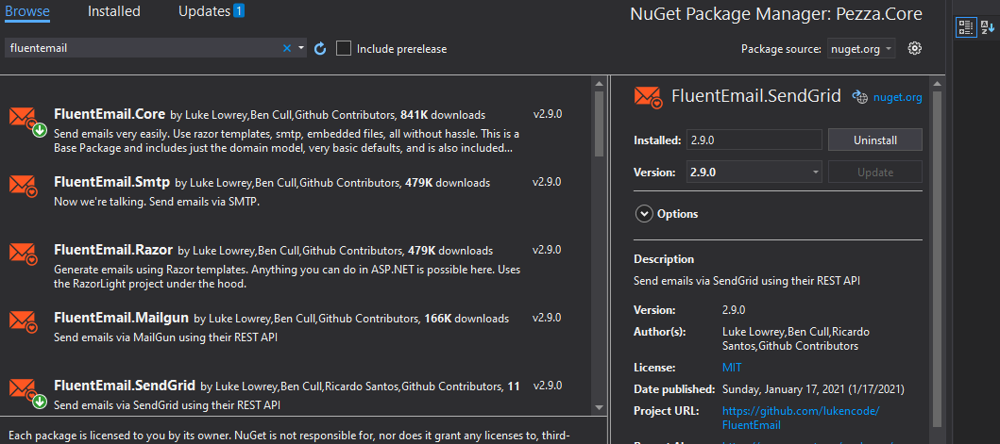
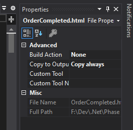
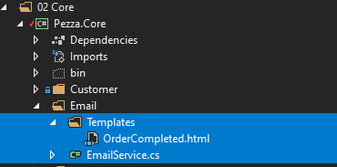

# &nbsp;**Pezza - Phase 6 - Step 1** [](https://github.com/entelect-incubator/.NET/actions/workflows/dotnet-phase6-step1.yml)

<br/><br/>

We are going to create a basic Email Service using Fluent Email and SendGrid.

## **FluentEmail**

Install FluentEmail.Core and FluentEmail.SendGrid



In Pezza.Core create a new folder Email. Inside Email create a new EmailService.cs.

- [ ] Create a SendGrid account [Here](https://signup.sendgrid.com/)
- [ ] Create SendGrid API Key [How to](https://sendgrid.com/docs/ui/account-and-settings/api-keys/) | [Get API Key](https://app.sendgrid.com/settings/api_keys)


```cs
namespace Pezza.Core.Email
{
    using System.Text.RegularExpressions;
    using System.Threading.Tasks;
    using HtmlAgilityPack;
    using Pezza.Common.Models;
    using SendGrid;
    using SendGrid.Helpers.Mail;

    public class EmailService
    {
        public string HtmlContent { get; set; }

        public Common.Entities.Customer Customer { get; set; }

        public async Task<Result> SendEmail()
        {
            var doc = new HtmlDocument();
            doc.LoadHtml(this.HtmlContent);
            var plainText = doc.DocumentNode.SelectSingleNode("//body").InnerText;
            plainText = Regex.Replace(plainText, @"\s+", " ").Trim();

            var apiKey = "YOUR-API-KEY";
            var client = new SendGridClient(apiKey);
            var from = new EmailAddress("notify@pezza.com", "Pezza");
            var subject = $"Collect your order it while it's hot";
            var to = new EmailAddress(this.Customer?.Email, this.Customer?.Name);
            var plainTextContent = plainText;
            var htmlContent = this.HtmlContent;
            var msg = MailHelper.CreateSingleEmail(from, to, subject, plainTextContent, htmlContent);
            var response = await client.SendEmailAsync(msg);

            return response.StatusCode != System.Net.HttpStatusCode.OK ? Result.Failure("Email could not send") : Result.Success();
        }
    }
}
```

We will use an HTML template that will be read, tag inside the template will be replace and then send to the customer.

Create a new Folder in Email called Templates - Side note - of you have a lot of Templates, better to move to Pezza.Common.

Create OrderCompleted.html. The HTML might look a bit strange to you, it's because it is made for email client support.

Look in Phase 6/Data/OrderCompleted.html and Copy it into Email/Templates.

Right-click on OrderCompleted.html and Choose Copy always for Copy to Output.





## **STEP 2 - Event**

Move to Step 2
[Click Here](https://github.com/entelect-incubator/.NET/tree/master/Phase%202/Step%202) 