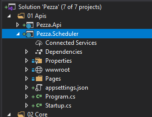
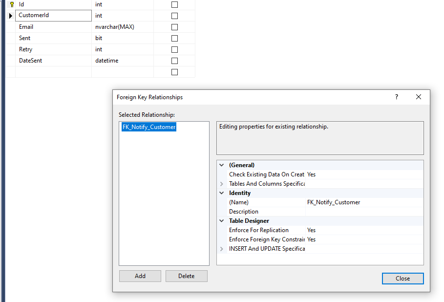

# &nbsp;**Pezza - Phase 6 - Step 3** [](https://github.com/entelect-incubator/.NET/actions/workflows/dotnet-phase6-step3.yml)

<br/><br/>

## **Schedule Background Jobs**

[Hangfire](https://www.hangfire.io/) provides an easy way to perform background processing in .NET and .NET Core applications. No Windows Service or separate process is required.

The benefit of using Hangfire is that it comes with a Dashboard. [Hangfire Dashboard](https://docs.hangfire.io/en/latest/configuration/using-dashboard.html) is a place where you could find all the information about your background jobs. It is written as an OWIN middleware, so you can plug it into your ASP.NET, ASP.NET MVC, Nancy, ServiceStack application as well as use the OWIN Self-Host feature to host Dashboard inside console applications or in Windows Services.

General problems with relying on the external systems are fire and forget or performance. You send a request out, but what happens if it fails or times out? Do you impact the system by waiting for this request to be sent?

Read more on [Fire and Forget Pattern](https://ducmanhphan.github.io/2020-02-24-fire-and-forget-pattern/).

## Solution...

Adding the request on a type of queue system and forgetting about the result. You can also implement a webhook/event when the request is done. In this Step, we will only look at adding on the Notify table and using the Hangfire job to read any emails that haven't been sent.

## **Pezza.Scheduler**

Create a new ASP.NET Core Web Application Pezza.Scheduler under 01. Apis




## **Nuget Packages**

Once the project is ready, I will open the NuGet package manager UI and add the necessary NuGet packages. The three main Nuget packages needed for hangfire are:

- [ ] Hangfire.Core – The core package that supports the core logic of Hangfire
- [ ] Hangfire.AspNetCore – Support for ASP.Net Core Middleware and Middleware for the dashboard user interface
- [ ] Hangfire.SqlServer - SQL Server 2008+ (including Express), SQL Server LocalDB and SQL Azure storage support for Hangfire (background job system for ASP.NET applications).

## **Connection String**

Add Connection String in appsetting.json Pezza.Scheduler

```json
"ConnectionStrings": {
    "PezzaDatabase": "Server=.;Database=PezzaDb;Trusted_Connection=True;"
},
```

## **Configuring Hangfire**

Once all the NuGet packages are installed, it is time to configure the server. To do that, I will open the Startup.cs file and update the ConfigureServices method of the Startup class.

```cs
services.AddHangfire(config =>
    config.SetDataCompatibilityLevel(CompatibilityLevel.Version_170)
        .UseSimpleAssemblyNameTypeSerializer()
        .UseDefaultTypeSerializer()
        .UseSqlServerStorage(this.Configuration.GetConnectionString("PezzaDatabase")));
```

In the above code, the AddHangfire method takes an Action delegate, which passes IGlobalConfiguration of the Hangfire ecosystem to configure the Hangfire.

And here first I will call the SetDataCompatibilityLevel method on the IGlobalConfiguration instance passed to set the compatibility to Version_170.

Next, I will call the UseSimpleAssemblyNameTypeSerializer and UseDefaultTypeSerializer one after the other, to set serialization configuration.

Finally, I will call UseSqlServerStorage and pass it the connection string to the Pezza database to set up the storage provider.

Next, I will call the extension method AddHangfireServer on the IServiceCollection instance to add the Hangfire server to the dependency injection container. Which we will use later to configure and run jobs.

## **Dashboard**

Once the basic setup for the dependency injection container is done, now I will add the middleware needed to add the Hangfire Dashboard UI. For that, I will call the extension method UseHangfireDashboard on the IApplicationBuilder instance in the Configure method of the Pezza.Scheduler StartUp class.

```cs
app.UseHangfireDashboard();
```

Finally, just to test a basic Hangfire job, I will use the Enqueue method of the IBackgroundJobClient instance to enqueue a simple Console.WriteLine statement.

To achieve this I will update the Configure method to accept a new parameter IBackgroundJobClient. This will be passed by the dependency injection container since we added the Hangfire server earlier by calling the AddHangfireServer method.

```cs
backgroundJobClient.Enqueue(() => Console.WriteLine("Run Hangfire job while it's hot!"));
```

## **Running the Scheduler**

Now, the above job will just print Run Hangfire job while it's hot! to the console output.

I will run the application to see the output as well as the Hangfire dashboard UI. To access the dashboard UI, we will navigate to the resource /hangfire.


Remove the backgroundJobClient.Enqueue.

## **Refactor**

Before we can create the recurring job we need to change the Order Complete Event to add to the Notify table as a queue item instead of sending the email out.

Hold on to this piece of code for later

```cs
var emailService = new EmailService
{
    Customer = notification.CompletedOrder?.Customer,
    HtmlContent = html
};

var send = await emailService.SendEmail();
```

When calling unsent notifications we want to pull in the customer detail as well. To do this we will need to add a foreign Key to Customers on the Notify Table.



Modify Customer.cs by adding the following property

```cs
public virtual ICollection<Notify> Notifies { get; set; }
```

In Pezza.Common, modify Notify.cs and NotifyDTO.cs. Add a Customer property to Notify.cs

```cs
public virtual Customer Customer { get; set; }
```

and a CustomerDTO property to NotifyDTO.cs

```cs
public virtual CustomerDTO Customer { get; set; }
```

In Pezza.DataAccess\Mapping modify NotifyMap.cs

```cs
builder.HasOne(t => t.Customer)
    .WithMany(t => t.Notifies)
    .HasForeignKey(d => d.CustomerId)
    .HasConstraintName("FK_Notify_Customer");
```

NotifyDataAccess.cs

```cs
var entities = this.databaseContext.Notify.Include(x => x.Customer).Select(x => x)
```

OrderCompleteJob.cs

```cs
namespace Pezza.Scheduler.Jobs
{
    using System.Threading.Tasks;
    using MediatR;
    using Pezza.Common.DTO;
    using Pezza.Common.Models;
    using Pezza.Core.Customer.Queries;
    using Pezza.Core.Email;
    using Pezza.Core.Notify.Queries;

    public class OrderCompleteJob : IOrderCompleteJob
    {
        private IMediator mediator;

        public OrderCompleteJob(IMediator mediator) => this.mediator = mediator;

        public async Task SendNotificationAsync()
        {
            var notifiesResult = await this.mediator.Send(new GetNotifiesQuery
            {
                dto = new NotifyDTO
                {
                    Sent = false,
                    PagingArgs = PagingArgs.Default
                }
            });

            if (notifiesResult.Succeeded)
            {
                foreach (var notification in notifiesResult.Data)
                {
                    if (notification.CustomerId.HasValue)
                    {
                        var customerResult = await this.mediator.Send(new GetCustomerQuery
                        {
                            Id = notification.CustomerId.Value
                        });

                        if (customerResult.Succeeded)
                        {
                            var emailService = new EmailService
                            {
                                Customer = customerResult.Data,
                                HtmlContent = notification.Email
                            };

                            var send = await emailService.SendEmail();
                        }
                    }
                }
            }
        }
    }
}
```

Startup.cs

```cs
 services.AddDbContext<DatabaseContext>(options =>
    options.UseSqlServer(this.Configuration.GetConnectionString("PezzaDatabase")));
```

## **Create a recurring job**

Creating a background job as we did above is easy with Hangfire, but it is as easy using an instance of Task class as well. So why go with something like Hangfire and install all these packages into the project?

Well, the main advantage of Hangfire comes in when we use it for creating scheduling jobs. It uses CRON expressions for scheduling.

Let us say we need to create a job that is responsible for finding any emails in Notify table that hasn't been send and send them out.

Create a new folder Jobs and inside that IOrderCompleteJob.cs interface and OrderCompleteJob.cs.

```cs
namespace Pezza.Scheduler.Jobs
{
    using System.Threading.Tasks;

    public interface IOrderCompleteJob
    {
        Task SendNotficationAsync();
    }
}
```

```cs
namespace Pezza.Scheduler.Jobs
{
    using System.Threading.Tasks;
    using MediatR;
    using Pezza.Common.DTO;
    using Pezza.Common.Models;
    using Pezza.Core.Email;
    using Pezza.Core.Notify.Queries;

    public class OrderCompleteJob : IOrderCompleteJob
    {
        private IMediator mediator;

        public OrderCompleteJob(IMediator mediator) => this.mediator = mediator;

        public async Task SendNotficationAsync()
        {
            var result = await this.mediator.Send(new GetNotifiesQuery
            {
                SearchModel = new NotifyDTO
                {
                    Sent = false,
                    PagingArgs = PagingArgs.Default
                }
            });
            if (result.Succeeded)
            {
                foreach (var notification in result.Data)
                {
                    var emailService = new EmailService
                    {
                        Customer = notification.Customer,
                        HtmlContent = notification.Email
                    };

                    var send = await emailService.SendEmail();
                }
            }
        }
    }
}
```

## **Configure Startup class**

Once the OrderCompleteJob class is created, it is time to configure the Startup class. In the Startup class, the objective is to configure a recurring job to call the SendNotficationAsync method every minute.

Firstly, I will add the OrderCompleteJob to the dependency injection container in the ConfigureServices method.

```cs
services.AddSingleton<IOrderCompleteJob, OrderCompleteJob>();
```

Secondly, I will update the Configure method to take two new parameters. The first one is the IRecurringJobManager necessary for creating a recurring job. And the second one is the IServiceProvider to get the IPrintJob instance from the dependency injection container.

Thirdly, I will call the AddOrUpdate on the IRecurringJobManager instance to set up a recurring job.

```cs
public void Configure(IApplicationBuilder app, IWebHostEnvironment env, IRecurringJobManager recurringJobManager, IServiceProvider serviceProvider)
```

```cs
recurringJobManager.AddOrUpdate(
    "Run every minute",
    () => serviceProvider.GetService<IOrderCompleteJob>().SendNotficationAsync(),
    "* * * * *"
    );
```

In the above code, the CRON expression "* * * * *" is an expression to run the job every minute.


## **Phase 7 - Create UI's**

Move to Phase 7
[Click Here](https://github.com/entelect-incubator/.NET/tree/master/Phase%207)